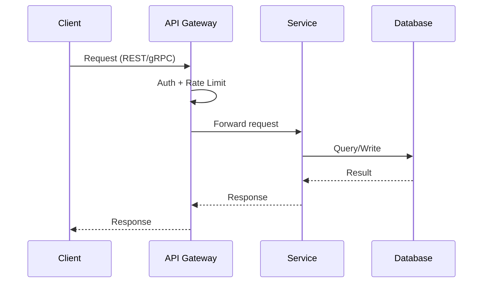

# Presale Architecture

## Core Rule

**Architecture = visual diagram.** Never describe system components with bullet points or prose alone. Every architecture section MUST contain ASCII box-art for static views and Mermaid sequence diagrams for dynamic flows.

## When to Use

- Proposal section 5 (Technical Architecture)
- `workspace/technical.md` creation
- When `technical` or `proposal` skill needs system diagrams

## Procedure

1. Identify architecture type:
   - **Greenfield**: Target Architecture + Data Flow
   - **Brownfield**: AS-IS → TO-BE → Migration Path + Data Flow
2. Draw static view as ASCII layered box art.
3. Draw dynamic view as Mermaid sequence diagram.
4. Annotate phase-specific components with `(Phase N)`.

## Static View: ASCII Layered Box Art

### Structure (top-to-bottom)

```
CLIENT LAYER        → Apps, portals, dashboards
API GATEWAY         → Routing, auth, rate limiting
SERVICE LAYER       → Core business services
DATA LAYER          → Databases, caches, storage
EVENT/MESSAGING     → Async communication (if applicable)
EXTERNAL            → 3rd-party integrations
```

### Format Rules

- Use box-drawing chars: `┌ ┐ └ ┘ │ ─ ├ ┤ ┬ ┴`, arrows: `▼ ▶ ◀ ▲`
- Each layer = one large box containing component boxes
- Label each component box with technology + bullet responsibilities
- Connect layers with arrows and protocol labels (REST, gRPC, WebSocket, Pub/Sub)
- Tag phase-specific components with `(Phase N)`
- Keep width under 80 characters

## Dynamic View: Mermaid Sequence Diagram



### Rules for Mermaid

- Show the primary happy-path flow.
- Use `participant` aliases for readability.
- Label arrows with protocol or action (REST, gRPC, Pub/Sub, WebSocket).
- Add `Note over` for important async or background processes.
- Keep under 15 interactions per diagram — split into multiple if needed.

## Rules

- Keep ASCII width under 80 characters.
- Label every box with technology choice + responsibilities.
- Show connections between layers with arrows and protocol labels.
- Presale level — show system boundaries, not internal class structure.
- Annotate which components belong to which delivery phase.
- For brownfield: clearly mark what exists (AS-IS) vs what's new (TO-BE).
- One diagram per architectural view — don't overload a single diagram.
