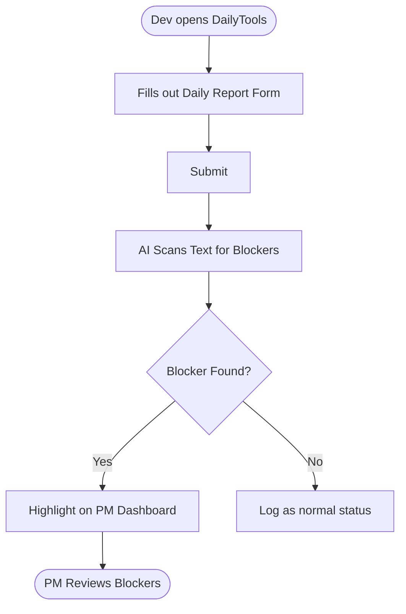
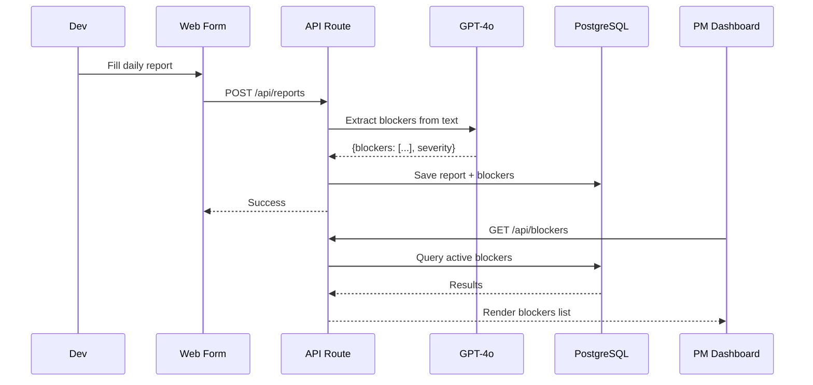

# Proposal: DailyTools MVP
**Author**: Antigravity AI
**Date**: 2026-05-17
**Version**: Final (8-Section v2)

---

## 1. Project Overview

### 1.1 Context & Problem Statement
- **Current State**: Project Managers (PMs) currently lack immediate visibility into critical blockers. Daily updates from the development team are often unstructured, too long, or buried in chat channels. This leads to PMs missing critical issues and wasting time manually parsing text.
- **Root Cause Analysis**:

| # | Pain Point | Root Cause | Severity |
|:--|:-----------|:----------------|:------:|
| P1 | Lack of visibility into dev blockers | Daily reports are too long or unstructured | High |
| P2 | Manual parsing of updates | Devs write unstructured text in chat | High |

### 1.2 Goals & Business Impact
- **Goal**: Provide a lightweight, automated way to collect dev updates and instantly extract blockers using AI.
- **Type**: Greenfield MVP Development (Simple Trial)
- **Business Benefits**:
    - [x] **Time Savings**: Reduce PM effort in parsing daily reports.
    - [x] **Risk Mitigation**: Catch and highlight blockers immediately before they cause delays.
    - [x] **Developer Experience**: A frictionless, 3-field form that takes 30 seconds to fill out.

### 1.3 Proposed Solution Overview
DailyTools is a lightweight web application that automates the collection and analysis of developer daily reports. Developers submit a simple 3-field form (What I did, What I will do, Blockers). An AI engine powered by GPT-4o scans each submission in real-time to detect hidden blockers or risks — even when developers don't explicitly flag them. PMs get a dedicated dashboard showing active blockers at a glance, eliminating the need to manually read through chat messages or lengthy reports.

### 1.4 Company Showcase (Optional)
N/A — No relevant case studies provided for this project.

## 2. Scope & Solution

### 2.1 In-Scope
The MVP for DailyTools focuses on a simple text-based data collection and extraction trial, prioritized by the MoSCoW method:
- **Web Form for Devs (Must-have)**: A simple web form (What I did, What I will do, Blockers) for daily submission.
- **AI Blocker Extraction (Must-have)**: Processing the submitted text with GPT-4o to flag and highlight hidden blockers.
- **PM Dashboard (Must-have)**: A clean view for PMs to instantly see active blockers and historical daily logs.

### 2.2 Out-of-Scope
- **Real-time Live Transcription**: Irrelevant to this text-based MVP.
- **Jira/Notion Sync**: Deferred to Phase 2 to keep the MVP simple.

## 3. User Flow & Wireframe

### 3.1 User Flow
Developers submit daily reports through a simple web form. The AI engine scans each submission for blockers. If a blocker is detected, it is highlighted on the PM Dashboard for immediate action. Otherwise, the report is logged as a normal status update.



### 3.2 High-Level Wireframe
- **Dev Form**: Three fields — What I did, What I will do, Blockers (Optional). Single submit button.
- **PM Dashboard**: Active Blockers alert section at the top, followed by a chronological list of standard daily updates.

## 4. Risks, Assumptions & Acceptance Criteria

### 4.1 Strategic Assumptions
| # | Category | Assumption | Note |
|:--|:---------|:-----------|:-----|
| A1 | Adoption | Developers will consistently use the web form instead of chat channels | Form must be ultra-fast (<30s to fill) |
| A2 | AI Accuracy | GPT-4o will accurately differentiate between standard updates and critical blockers | Prompt tuning required during Phase 2 |
| A3 | Scale | Initial team size ~50 developers | Affects infra sizing decisions |

### 4.2 Risk & Mitigation
| # | Risk | Severity | Impact | Mitigation |
|:--|:-----|:--------:|:-------|:-----------|
| R1 | Low adoption by devs | High | No data to extract blockers from | Make the form ultra-fast (3 fields) and mobile-friendly. |
| R2 | AI missing hidden blockers | Medium | False sense of security for PMs | Allow devs to explicitly tag blockers, plus prompt-tuning. |

### 4.3 Acceptance Criteria
| # | Item | Measurement Criteria | Phase |
|:--|:-----|:---------------------|:------|
| AC1 | Form Submission | Devs can submit form and data saves to DB correctly. | Phase 1 |
| AC2 | Blocker Extraction | AI correctly flags blockers in 90% of test inputs. | Phase 2 |
| AC3 | Dashboard Visibility | PM dashboard renders active blockers clearly above normal logs. | Phase 3 |

<!-- PLACEHOLDER_SECTION_5 -->

## 5. Technical Architecture

### 5.1 Target Architecture
DailyTools uses a simple Next.js monolithic architecture for rapid MVP delivery.

```text
┌─ CLIENT (Next.js / React) ───────────────┐
│  ┌──────────────┐  ┌──────────────────┐  │
│  │ Dev Report   │  │ PM Dashboard     │  │
│  │ Form         │  │ (Blockers View)  │  │
│  └──────────────┘  └──────────────────┘  │
└──────────────────────────────────────────┘
              │
              ▼
┌─ API (Next.js API Routes) ───────────────┐
│  [Auth]  [Submit Report]  [Get Blockers] │
└──────────────────────────────────────────┘
              │
              ▼
┌─ SERVICE ────────────────────────────────┐
│  ┌─────────────────────────────────────┐ │
│  │ AI Blocker Extraction (GPT-4o)     │ │
│  │ • Scan text for hidden blockers    │ │
│  │ • Classify severity                │ │
│  └─────────────────────────────────────┘ │
└──────────────────────────────────────────┘
              │
              ▼
┌─ DATA (PostgreSQL / Supabase) ───────────┐
│  • reports    • blockers    • users      │
└──────────────────────────────────────────┘
```

### 5.2 Tech Stack
| Layer | Technology | Role | Why |
|:------|:-----------|:-----|:----|
| Fullstack | Next.js / TypeScript | Unified frontend and backend API | Rapid MVP delivery with single codebase, SSR for fast load |
| AI / NLP | OpenAI GPT-4o | Text analysis and blocker extraction | Best-in-class text understanding, low integration effort |
| Database | PostgreSQL (Supabase) | Data storage | Managed service, built-in auth, real-time subscriptions |
| Hosting | Vercel | Zero-config deployment | Native Next.js support, serverless scaling, free tier for MVP |

### 5.3 Data Flow



### 5.4 Capacity Planning & Infrastructure Sizing
#### Traffic Estimation
| Metric | Value | Calculation |
|:-------|:------|:------------|
| Avg Reports / Day | 50 | Initial dev team size |
| Storage / Report | < 5KB | Plain text data |
| Daily Data Volume | < 1MB | Extremely lightweight |

#### Infrastructure Sizing
- **Compute**: Next.js Serverless functions (Vercel).
- **Storage**: None needed beyond the database.
- **Database**: PostgreSQL (Supabase/Vercel Postgres) for text logs.

<!-- PLACEHOLDER_SECTION_6 -->

## 6. Implementation Plan

### 6.1 Product Roadmap
| Phase | Feature | Duration | Timeline | W1 | W2 | W3 | W4 |
|-------|---------|----------|----------|:--:|:--:|:--:|:--:|
| P1 | Form & Database | 1 week | Week 1 | ███ |    |    |    |
| P2 | AI Blocker Engine | 1 week | Week 2 |     | ███ |    |    |
| P3 | PM Dashboard View | 1 week | Week 3 |     |     | ███ |    |
| P4 | UAT & Launch | 1 week | Week 4 |     |     |     | ███ |

**Legend:** `███` = Active development period

**Key Highlights:**
- **Week 1**: Deploy the basic web form for Devs.
- **Week 2**: Integrate OpenAI and tune the prompt for blocker extraction.
- **Week 3**: Finalize the dashboard for the PM.
- **Week 4**: UAT and Live launch of the MVP.

### 6.2 Project Milestone Breakdown
| # | Milestone | Target Date | Key Modules | DoD | Verification Tool |
|---|-----------|-------------|-------------|-----|-------------------|
| M1 | Form Ready | Week 1 | Web Form & DB | Form submits to DB | Manual Test |
| M2 | AI Ready | Week 2 | AI Extraction | 90% accuracy | QA Review |
| M3 | Dashboard | Week 3 | PM UI | PM sees blockers | UI Test |
| M4 | Launch | Week 4 | Live Deploy | Signed off | UAT |

### 6.3 Delivery Plan
- **Model**: Fixed-scope, time-boxed (4 weeks)
- **Cadence**: Weekly demo to PM stakeholder at end of each phase
- **Handover**: Source code + deployment credentials + prompt documentation
- **Support**: 2-week bug-fix warranty post-launch

## 7. WBS & Resources

### 7.1 WBS Details
Refer to the detailed [WBS Document](wbs.md) for task-level estimates and dependencies.

### 7.2 Resource Plan
| Role | FTE | Responsibility |
|:-----|:---:|:---------------|
| Solutions Architect | 0.1 | System design |
| Fullstack Developer | 1.0 | Frontend, API, and DB |
| AI Engineer | 0.3 | Prompt engineering |
| QA Engineer | 0.2 | End-to-end testing |

### 7.3 Resource Estimation
| Phase | Dev/Ops (h) | QA (h) | Total | Target | Quick summary |
|:------|:-----------:|:------:|:-----:|:-------|:--------------|
| P1: Foundation | 24 | 4 | 28 | Week 1 | Setup and Web Form |
| P2: AI Engine | 28 | 8 | 36 | Week 2 | LLM logic |
| P3: Dashboard | 20 | 8 | 28 | Week 3 | PM UI |
| P4: Launch | 8 | 12 | 20 | Week 4 | UAT and Bug fixing |

## 8. Budget & Commercials

### 8.1 Development Cost
- **Total Effort**: 112 working hours.
- **Development Cost**: TBD by final resource allocation.

### 8.2 Operational Cost & Scaling Strategy
| Phase | Capacity | Infra Cost/month | Main Components |
|:------|:---------|:-----------------|:----------------|
| MVP | 50 Devs | $20 | Vercel, Supabase |

### 8.3 3rd-Party Vendor & Pass-Through Costs
| Service | Vendor | Ownership | Pass-through Cost Model |
|:--------|:-------|:----------|:------------------------|
| Cloud Infrastructure | Vercel | Client | Billed directly to Client's credit card |
| AI / LLM API | OpenAI (GPT-4o) | Client | Pay-as-you-go based on volume |
