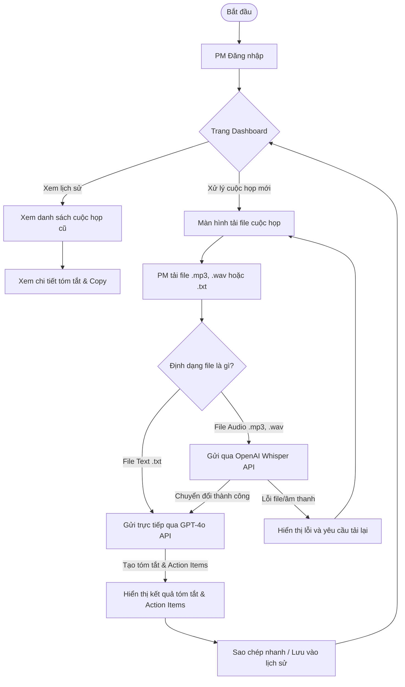
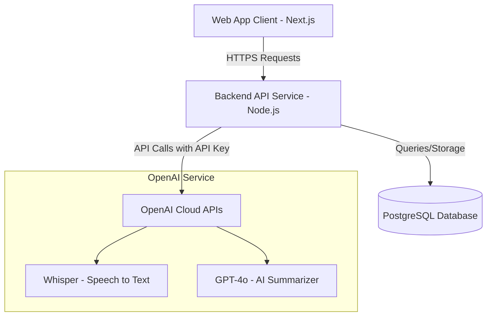
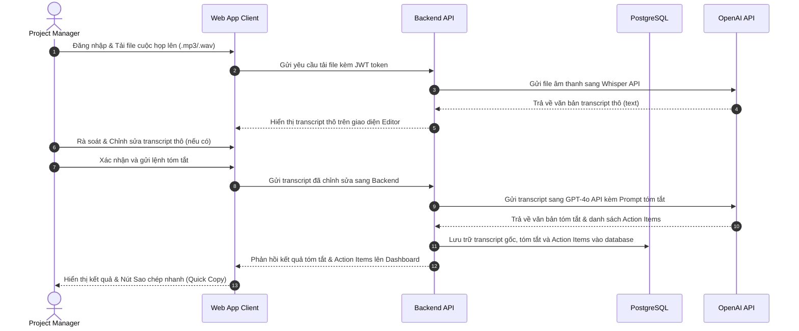

# Proposal: 2026 05 16 Dailytools
**Author**: Ryan Nguyen
**Date**: 2026-05-18
**Version**: Final

# 01 - Tổng Quan Dự Án & Giá Trị Kinh Doanh

## 1.1 Bối Cảnh & Vấn Đề (Context & Problem Statement)

Các Quản trị dự án (PM) đang mất nhiều thời gian cho việc ghi chép biên bản họp và phân công công việc sau mỗi buổi thảo luận, làm giảm đáng kể hiệu suất làm việc.

Các vấn đề cốt lõi:
- Tốn công sức hành chính: PM phải dành 30–60 phút sau mỗi cuộc họp để nghe lại ghi âm, ghi ý chính và soạn danh sách công việc — gián đoạn luồng công việc chiến lược.
- Rủi ro bỏ sót thông tin: Ghi chép thủ công trong cuộc họp nhanh dễ bỏ sót quyết định quan trọng hoặc Action Items, gây thiếu đồng bộ đội ngũ.
- Thiếu lưu trữ tập trung: Biên bản họp phân tán ở email, chat, file cá nhân — khó tra cứu lịch sử quyết định.

## 1.2 Mục Tiêu & Tác Động Kinh Doanh (Goals & Business Impact)

DailyTools MVP xây dựng nền tảng Web thông minh giúp PM tự động chuyển đổi âm thanh cuộc họp thành văn bản, trích xuất tóm tắt và danh sách công việc — cắt giảm tối đa công sức hành chính.

Loại hình dự án: Phát triển sản phẩm mới (Greenfield MVP).

Lợi ích kinh doanh:
- Tối ưu thời gian PM: Giảm thời gian tổng hợp biên bản từ hàng chục phút xuống dưới 1 phút nhờ AI tự động.
- Nâng cao tính trách nhiệm: Trích xuất chính xác Action Items kèm người phụ trách từ hội thoại, cải thiện tỷ lệ hoàn thành công việc.
- Quản lý tập trung: Toàn bộ lịch sử tóm tắt họp lưu trên một dashboard duy nhất, dễ tìm kiếm và đối chiếu.

# 02 - Giải Pháp Đề Xuất & Quy Trình Trải Nghiệm

## 2.1 Tổng Quan Giải Pháp (Solution Overview)

DailyTools là ứng dụng Web responsive, tối giản, thiết kế chuyên biệt cho PM. Hệ thống tích hợp Cloud API để tự động hóa toàn bộ quy trình: tiếp nhận âm thanh cuộc họp → chuyển đổi văn bản → phân tích tóm tắt — loại bỏ hoàn toàn tác vụ hành chính thủ công.

## 2.2 Các Tính Năng Chính (Key Features)

**Đăng nhập & Bảo mật tài khoản PM**
Xác thực tài khoản cá nhân cho từng PM, mỗi người sở hữu không gian lưu trữ và quản lý cuộc họp độc lập, đảm bảo bảo mật dữ liệu dự án.

**Dashboard quản lý lịch sử họp**
Dashboard tập trung hiển thị toàn bộ cuộc họp đã xử lý. PM dễ dàng tìm kiếm, xem lại nội dung họp cũ chỉ với vài thao tác.

**Tiếp nhận dữ liệu đa định dạng (Upload Module)**
Hỗ trợ tải file âm thanh (.mp3, .wav) và văn bản thô (.txt), giúp PM linh hoạt đưa dữ liệu từ nhiều nguồn vào hệ thống.

**Chuyển đổi âm thanh tự động (Speech-to-Text)**
Tích hợp OpenAI Whisper API tự động chuyển đổi file âm thanh tiếng Việt/tiếng Anh thành văn bản thô trong vài giây với độ chính xác cao.

**Biên tập văn bản (Transcript Editor)**
Trình biên tập trực quan cho PM rà soát và chỉnh sửa văn bản thô (thuật ngữ chuyên ngành, tên riêng) trước khi gửi yêu cầu tóm tắt AI.

**Tóm tắt thông minh & Trích xuất Action Items**
Sử dụng OpenAI GPT-4o phân tích văn bản cuộc họp, xuất ra bản tóm tắt ngắn gọn và danh sách Action Items dạng checklist rõ ràng.

**Sao chép nhanh một chạm (Quick Copy)**
Nút sao chép riêng biệt cho phần Tóm tắt và Action Items, PM dán thẳng vào email, Slack, Zalo hoặc Jira.

## 2.3 Luồng Người Dùng (User Flow)

Quy trình DailyTools được tối ưu để PM đạt kết quả nhanh nhất — từ đăng nhập, tải file, chuyển đổi âm thanh và tóm tắt, đến sao chép chia sẻ.

# 03 - Phạm Vi Dự Án

## 3.1 Trong Phạm Vi Phát Triển (In-Scope)

- **Quản lý tài khoản PM (Authentication):** Luồng đăng nhập/đăng xuất bảo mật, API xác thực JWT bảo vệ dữ liệu lịch sử họp cá nhân.
- **Dashboard lịch sử họp:** Giao diện danh sách cuộc họp đã xử lý theo thời gian, API truy vấn phân trang và hiển thị trạng thái.
- **Upload file cuộc họp:** Giao diện kéo thả cho file âm thanh (.mp3, .wav) hoặc văn bản (.txt), kiểm tra dung lượng (tối đa 100MB) và định dạng hợp lệ.
- **Speech-to-Text:** Tích hợp OpenAI Whisper API chuyển file ghi âm thành transcript thô tiếng Việt/tiếng Anh.
- **Transcript Editor:** Giao diện xem và chỉnh sửa thủ công văn bản thô trước khi gửi lệnh tóm tắt.
- **AI Summary & Action Items:** Tích hợp OpenAI GPT-4o phân tích transcript, tạo báo cáo tóm tắt và danh sách đầu việc dạng checkbox.
- **Meeting Detail & Quick Copy:** Giao diện chi tiết kết quả tóm tắt, nút sao chép nhanh riêng cho Tóm tắt và Action Items.

## 3.2 Ngoài Phạm Vi MVP (Out-of-Scope)

- **Ghi âm trực tiếp từ trình duyệt:** Không hỗ trợ thu âm qua microphone trên Web App để tối giản giao diện và tránh rủi ro kỹ thuật quyền truy cập thiết bị.
- **Bot tham gia cuộc họp trực tuyến:** Không phát triển bot tự động join Zoom, Google Meet hoặc Teams — cấu trúc tích hợp phức tạp, vượt khung thời gian MVP.
- **Phân quyền đa cấp (RBAC):** Chỉ quản lý 1 loại tài khoản PM duy nhất, không hỗ trợ Admin/Member/Guest.
- **Đồng bộ công cụ bên thứ ba:** Không gọi API trực tiếp đẩy task sang Jira/Trello hoặc gửi tin nhắn Slack tự động. PM sử dụng tính năng Sao chép nhanh thay thế.

# 04 - Giả Định Chiến Lược & Quản Trị Rủi Ro

## 4.1 Giả Định Chiến Lược (Strategic Assumptions)

- **Chi phí API bên thứ ba:** Khách hàng cung cấp tài khoản và chịu toàn bộ chi phí sử dụng OpenAI API (Whisper + GPT-4o) trong quá trình phát triển, thử nghiệm và vận hành.
- **Ngôn ngữ cuộc họp:** Hệ thống hỗ trợ Tiếng Việt và Tiếng Anh — hai ngôn ngữ có độ chính xác cao nhất với OpenAI hiện tại.
- **Giới hạn thời lượng:** File ghi âm tối đa 2 giờ/file để đảm bảo nằm trong context window của GPT-4o và tránh timeout API.
- **Hạ tầng deployment:** Khách hàng cung cấp quyền truy cập hosting (Vercel, AWS hoặc tương đương) từ tuần thứ 3 để cấu hình staging và production.

## 4.2 Rủi Ro & Biện Pháp Giảm Thiểu (Risk & Mitigation)

**Chất lượng nhận diện giọng nói giảm do tiếng ồn (Mức độ: Trung bình)**
Môi trường ghi âm nhiều tạp âm, micro xa hoặc nói đè giọng có thể làm Whisper dịch sai.
*Biện pháp:* Khuyến cáo chất lượng ghi âm trên màn hình upload; Transcript Editor cho PM sửa từ sai trước khi tóm tắt.

**Chi phí API OpenAI tăng đột biến (Mức độ: Thấp)**
Sử dụng tần suất cao hoặc file dung lượng lớn liên tục có thể đẩy chi phí API ngoài kiểm soát.
*Biện pháp:* Hướng dẫn khách hàng cấu hình giới hạn chi tiêu (hard limit/soft limit) trên OpenAI Dashboard ngay từ ngày đầu.

# 05 - Kiến Trúc Kỹ Thuật Sơ Bộ

## 5.1 Kiến Trúc Mục Tiêu (Target Architecture)

Hệ thống được thiết kế theo kiến trúc Client-Server tối giản và hiệu quả. Ứng dụng Web tương tác trực tiếp với người dùng và gửi yêu cầu thông qua kết nối bảo mật tới Backend API. API Service chịu trách nhiệm xử lý nghiệp vụ, lưu trữ cơ sở dữ liệu và đóng vai trò cổng kết nối (Gateway) điều phối cuộc gọi tới các API OpenAI.

## 5.2 Công Nghệ Lựa Chọn (Tech Stack)

Để tối ưu hóa thời gian phát triển trong vòng 1-1.5 tháng và đảm bảo chất lượng, đội ngũ đề xuất các công nghệ sau:
- **Frontend Framework:** React.js & Next.js giúp xây dựng giao diện responsive nhanh chóng, hỗ trợ render phía máy chủ tốt và tối ưu hóa trải nghiệm tương tác của PM.
- **Backend Framework:** Node.js & Express.js cung cấp môi trường chạy gọn nhẹ, xử lý bất đồng bộ tối ưu khi tương tác với các API AI thời gian thực và đồng bộ tốt với Javascript của Frontend.
- **Cơ sở dữ liệu (Database):** PostgreSQL là hệ quản trị cơ sở dữ liệu quan hệ mã nguồn mở mạnh mẽ, đảm bảo tính toàn vẹn dữ liệu tài khoản và lưu trữ văn bản tóm tắt có cấu trúc an toàn.
- **Trí tuệ nhân tạo (AI Engine):** OpenAI API (Whisper & GPT-4o) được sử dụng để chuyển đổi giọng nói tiếng Việt/tiếng Anh và tóm tắt cuộc họp với chất lượng tối ưu nhất hiện nay mà không mất chi phí nghiên cứu phát triển mô hình riêng.
- **Hạ tầng triển khai (Hosting & Cloud):** Vercel (dành cho Frontend) và AWS EC2/RDS (dành cho Backend & Database) giúp giảm thiểu tối đa chi phí vận hành ban đầu và cung cấp cơ chế CI/CD tự động hóa việc deploy.

## 5.3 Luồng Dữ Liệu Xử Lý (Data Flow)

Luồng dữ liệu xử lý một file ghi âm từ khi PM tải lên cho đến khi lưu trữ kết quả tóm tắt cuối cùng:

## 5.4 Quy Mô & Dung Lượng (Capacity & Sizing)

Hệ thống được thiết kế phù hợp với nhu cầu sử dụng thực tế của một doanh nghiệp nhỏ:
- **Người dùng hoạt động:** Phục vụ từ 1 đến 5 PM sử dụng đồng thời hàng ngày để quản trị các dự án.
- **Tải trọng đồng thời:** Hệ thống hỗ trợ xử lý từ 2 đến 3 file ghi âm tải lên cùng một thời điểm mà không gây nghẽn băng thông.
- **Chiến lược lưu trữ:** File âm thanh sau khi được Whisper chuyển đổi thành công sang văn bản sẽ được tự động xóa khỏi bộ nhớ đệm của server để giải phóng dung lượng và tối ưu hóa chi phí lưu trữ đĩa cứng. Hệ thống chỉ lưu trữ văn bản transcript gốc và kết quả tóm tắt dạng text trong PostgreSQL Database.

## 5.5 Bảo Mật & Riêng Tư (Security & Privacy)

Dữ liệu cuộc họp là tài sản nhạy cảm của doanh nghiệp, do đó bảo mật được đặt lên hàng đầu:
- **Mã hóa đường truyền:** Toàn bộ dữ liệu truyền đi giữa Client, Backend và các dịch vụ OpenAI đều được mã hóa bằng giao thức HTTPS với chuẩn bảo mật TLS 1.3.
- **Quản lý phiên làm việc:** Sử dụng cơ chế JSON Web Token (JWT) lưu trữ ở client với thời gian hết hạn ngắn (ví dụ: 24 giờ) để ngăn chặn việc đánh cắp session.
- **Bảo mật khóa API bên thứ ba:** Khóa API OpenAI được lưu trữ an toàn trong biến môi trường (Environment Variables) phía Backend API. Client tuyệt đối không có quyền truy cập trực tiếp vào API Key này để tránh rò rỉ hoặc lạm dụng.

# 06 - Kế Hoạch Triển Khai & Bàn Giao

## 6.1 Lộ Trình Phát Triển Sản Phẩm (Product Roadmap)

Để đảm bảo sản phẩm MVP được bàn giao nhanh nhất và kiểm chứng hiệu quả thực tế của ý tưởng, chúng tôi đề xuất lộ trình triển khai cuốn chiếu trong vòng 4 tuần (1 tháng). Quy trình phát triển được phân chia thành các giai đoạn tập trung, mỗi giai đoạn giải quyết một nhóm tính năng độc lập và có sự phối hợp chặt chẽ giữa đội ngũ Frontend và Backend.

Dưới đây là bảng phân bổ lộ trình phát triển chi tiết cho các phân hệ tính năng qua từng tuần triển khai:

| Giai đoạn | Phân hệ tính năng chính | Thời gian dự kiến | Phân bổ nhân sự |
| --- | --- | --- | --- |
| **Tuần 1** | Khởi tạo dự án, thiết lập cơ sở dữ liệu và hoàn thiện phân hệ Đăng nhập/Đăng xuất cho PM. | 5 – 7 ngày | Backend Developer, Frontend Developer |
| **Tuần 2** | Phát triển module Tải file cuộc họp, tích hợp API OpenAI Whisper chuyển âm thanh sang văn bản và trình biên tập transcript. | 7 – 10 ngày | Backend Developer, Frontend Developer |
| **Tuần 3** | Tích hợp API OpenAI GPT-4o tóm tắt nội dung họp, xây dựng Dashboard lịch sử và tính năng Sao chép nhanh kết quả. | 5 – 8 ngày | Backend Developer, Frontend Developer |
| **Tuần 4** | Thực hiện kiểm thử tích hợp (QA), rà soát lỗi hệ thống và triển khai đưa ứng dụng lên internet (Go-live). | 4 – 6 ngày | QA Engineer, Backend Developer |

## 6.2 Các Mốc Bàn Giao & Tiêu Chí Nghiệm Thu (Milestones & Acceptance Criteria)

Quy trình nghiệm thu sản phẩm được thực hiện minh bạch tại cuối mỗi mốc bàn giao (Milestone). Khách hàng sẽ trực tiếp chạy thử các tính năng trên môi trường kiểm thử (Staging) để xác nhận hệ thống hoạt động ổn định và đáp ứng đầy đủ các tiêu chí nghiệp vụ dưới đây trước khi chuyển sang giai đoạn tiếp theo.

Dưới đây là danh sách chi tiết 4 mốc bàn giao của dự án kèm sản phẩm đầu ra và tiêu chí nghiệm thu tương ứng:

| # | Mốc bàn giao (Milestone) | Thời gian dự kiến | Sản phẩm bàn giao chính | Tiêu chí nghiệm thu (Acceptance Criteria) |
| --- | --- | --- | --- | --- |
| **M1** | Thiết lập hệ thống & Hoàn thiện Đăng nhập | Cuối Tuần 1 | Mã nguồn khung dự án trên GitHub; Cấu hình cơ sở dữ liệu PostgreSQL; Trang đăng nhập PM hoàn chỉnh. | Mã nguồn build thành công không lỗi; PM có thể đăng nhập bằng tài khoản demo được cấu hình sẵn trong DB và chuyển hướng vào Dashboard. |
| **M2** | Tích hợp AI & Chuyển đổi cuộc họp | Cuối Tuần 2 | Module upload file (mp3, wav, txt); Tích hợp API OpenAI Whisper; Giao diện Transcript Editor. | PM tải lên file ghi âm .mp3/.wav thành công; hệ thống trả về văn bản dịch thô (transcript) trên màn hình để PM chỉnh sửa văn bản. |
| **M3** | Dashboard lịch sử & Sao chép nhanh | Cuối Tuần 3 | Dashboard danh sách cuộc họp cũ; Giao diện xem chi tiết Tóm tắt & Action Items; Nút sao chép một chạm. | PM xem được danh sách lịch sử họp cũ; xem báo cáo tóm tắt cuộc họp; click nút Copy và dán được nội dung sang các ứng dụng chat (Zalo/Slack) bình thường. |
| **M4** | QA & Triển khai Production | Cuối Tuần 4 | Báo cáo kiểm thử QA Report; Ứng dụng Web chạy chính thức trên internet (Production). | 100% kịch bản kiểm thử cốt lõi vượt qua; ứng dụng hoạt động ổn định trên môi trường production của khách hàng dưới tên miền internet chính thức. |

# 07 - Ngân Sách & Phân Bổ Nhân Sự

## 7.1 Chi Phí Phát Triển Nhân Sự (Resource Allocation & Development Cost)

Chi phí phát triển được tính toán dựa trên mô hình giá cố định (Fixed Price) tương ứng với thời lượng và nỗ lực thực tế được phân rã trong WBS. Chúng tôi phân bổ đội ngũ nhân sự tối giản và chuyên môn hóa cao bao gồm một lập trình viên Backend cấp cao (Senior), một lập trình viên Frontend cấp trung (Middle) và một kỹ sư kiểm thử (QA Middle) để đảm bảo chất lượng kỹ thuật cao nhất và tiến độ bàn giao trong vòng 1 tháng.

Dưới đây là bảng tổng hợp chi phí nhân sự phát triển chi tiết cho dự án DailyTools MVP (được tính bằng Việt Nam Đồng - VND):

| Vai trò (Position) | Cấp bậc (Seniority) | Đơn giá / ngày (Unit Price) | Tháng 1 (Effort) | Tổng nỗ lực (Total Effort) | Tổng chi phí (Total Cost) |
| --- | --- | --- | --- | --- | --- |
| **Backend Developer** | Senior | 3.000.000 VND | 15 ngày | 15 ngày | 45.000.000 VND |
| **Frontend Developer** | Middle | 2.000.000 VND | 10 ngày | 10 ngày | 20.000.000 VND |
| **QA Engineer** | Middle | 1.500.000 VND | 5 ngày | 5 ngày | 7.500.000 VND |
| **Tổng cộng** | — | — | **30 ngày** | **30 ngày** | **72.500.000 VND** |

## 7.2 Chi Phí Vận Hành Hạ Tầng (Operational Cost - Infra)

Để tối ưu hóa chi phí vận hành cho phiên bản MVP, kiến trúc hệ thống tận dụng tối đa các chương trình miễn phí (Free Tier) từ các nhà cung cấp dịch vụ cloud. Frontend ứng dụng Next.js được triển khai miễn phí trên hạ tầng Vercel. Máy chủ API Backend và PostgreSQL Database được khuyến nghị chạy trên các gói server nhỏ gọn phù hợp với lượng người dùng nội bộ thấp.

Dưới đây là ước tính chi phí hạ tầng vận hành hàng tháng của hệ thống:

| Giai đoạn | Số lượng PM sử dụng | Chi phí hạ tầng / tháng | Các thành phần chính |
| --- | --- | --- | --- |
| **MVP Vận hành** | 1 – 5 người dùng | Khoảng 0 – 350.000 VND (0 - $15) | Frontend deploy miễn phí trên Vercel; Backend & PostgreSQL DB chạy trên AWS Free Tier hoặc gói basic của Render/DigitalOcean. |

## 7.3 Chi Phí Dịch Vụ Bên Thứ Ba (3rd-Party Vendor Costs)

Bên cạnh chi phí phát triển và hạ tầng máy chủ, hệ thống có phát sinh các chi phí sử dụng dịch vụ API dịch thuật và phân tích của OpenAI:
- **Dịch vụ OpenAI API (STT Whisper & GPT-4o)**: Chi phí thanh toán dựa trên lượng sử dụng thực tế (pay-as-you-go). Chi phí ước tính rất thấp, khoảng 500 VND cho mỗi phút dịch âm thanh (Whisper) và 1.000 - 2.000 VND cho mỗi cuộc gọi tóm tắt văn bản (GPT-4o). Ước tính tổng chi phí sử dụng thực tế khoảng 50.000 - 100.000 VND/PM/tháng. Dịch vụ này sẽ được thanh toán trực tiếp qua tài khoản thẻ liên kết OpenAI của khách hàng.
- **Chi phí mua tên miền (Domain Name)**: Khoảng 250.000 VND/năm (chi phí phát sinh nếu khách hàng chưa sở hữu sẵn tên miền riêng).

# 08 - Chi Phí & Lịch Thanh Toán

## 8.1 Tổng Chi Phí Phát Triển (Total Development Cost)

Tổng chi phí phát triển cố định cho dự án DailyTools MVP là **72.500.000 VND** (Bằng chữ: Bảy mươi hai triệu năm trăm nghìn đồng chẵn). Chi phí này đã bao gồm toàn bộ công việc phân tích, thiết kế giao diện, lập trình frontend/backend, kiểm thử chất lượng hệ thống và hỗ trợ triển khai go-live trong vòng 1 tháng. Chi phí này chưa bao gồm các khoản phí dịch vụ API OpenAI bên thứ ba và hạ tầng hosting riêng của khách hàng (nếu có).

## 8.2 Lịch Trình Thanh Toán Theo Mốc Bàn Giao (Payment Schedule)

Chi phí phát triển được chia làm 3 đợt thanh toán gắn liền với tiến độ nghiệm thu thực tế của các mốc bàn giao (Milestones) đã thống nhất tại Mục 6.2:

- **Đợt 1 (Tạm ứng & Bắt đầu):** Thanh toán **30%** tổng chi phí, tương đương **21.750.000 VND** ngay sau khi ký kết hợp đồng dịch vụ để đội ngũ khởi động dự án và thực hiện mốc **M1: Thiết lập hệ thống & Hoàn thiện Đăng nhập**.
- **Đợt 2 (Nghiệm thu Mốc M2):** Thanh toán **40%** tổng chi phí, tương đương **29.000.000 VND** sau khi khách hàng rà soát thử nghiệm và ký xác nhận nghiệm thu mốc **M2: Tích hợp AI & Chuyển đổi cuộc họp** (hoàn thành tích hợp API OpenAI Whisper & GPT-4o trên môi trường staging).
- **Đợt 3 (Quyết toán & Bàn giao):** Thanh toán **30%** còn lại, tương đương **21.750.000 VND** sau khi nghiệm thu mốc **M3: Dashboard lịch sử & Sao chép nhanh** và hoàn thành nghiệm thu bàn giao mốc **M4: QA & Triển khai Production** (Hệ thống đã deploy go-live chính thức dưới tên miền của khách hàng và bàn giao mã nguồn dự án).
