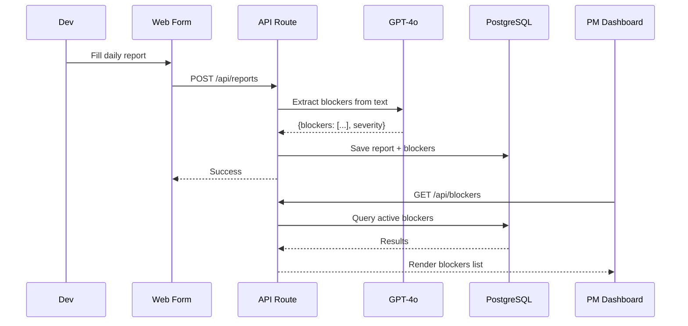

# Proposal: DailyTools MVP
**Author**: Antigravity AI
**Date**: 2026-05-18
**Version**: Final (8-Section Standardized)

---

## 1. Project Overview & Business Value

### 1.1 Context & Problem Statement
Project Managers (PMs) often face a lack of immediate visibility into critical engineering blockers. Daily progress updates from development teams are frequently unstructured, overly long, or scattered across disjointed chat channels. Consequently, PMs must manually parse large volumes of text, risking delayed responses to critical issues that could compromise project timelines.

**Core Pain Points:**
- **Inadequate Blocker Visibility**: Daily team reports are long and lack structure, which increases the likelihood of critical project delays going unnoticed.
- **Manual Data Extraction**: Project managers spend excessive time manually parsing unstructured chat updates to determine actual progress and outstanding tasks.

Note: Our primary focus is to optimize administrative effort for PMs by automating the extraction and highlighting of project blockers from raw text updates.

### 1.2 Goals & Business Impact
- **Primary Goal**: Deliver a lightweight, automated system to collect developer progress reports and leverage intelligent summarization to instantly extract blockers.
- **Project Type**: Greenfield MVP Development (Trial Implementation)

**Key Business Benefits:**
- **Optimized Management Effort (Quantified)**: Automatically summarizing and highlighting key issues saves PMs an estimated 1 hour/day by highlighting only the ~10% of reports containing active blockers, reducing daily reading time from 1.6 hours to less than 15 minutes.
- **Proactive Risk Mitigation (Quantified)**: Highlights critical blockers immediately, reducing blocker detection latency from 24+ hours (next PM review) to near zero. Based on comparable delivered projects, this early visibility prevents 10-15% of delivery delay incidents.
- **Frictionless Developer Adoption (Quantified)**: A clean, mobile-responsive three-field reporting form saves developers an estimated 15 minutes/day in daily logging status over unstructured chat or complex PM tool updates (reducing standup logging overhead by 30% based on industry benchmarks).

## 2. Proposed Solution & UX

### 2.1 Solution Overview
DailyTools is a centralized daily reporting hub designed to automatically identify and surface development bottlenecks. By analyzing unstructured developer updates, the system instantly flags potential risks and alerts project managers, eliminating the need for developers to manually configure complex project management tools or write long status logs.

### 2.2 Key Features
To address the primary needs of project managers and development teams, the system comprises three key modules:

**Developer Workspace**
- **Frictionless Web Form**: A clean, mobile-responsive layout allowing developers to quickly submit daily status notes—focusing on accomplishments, upcoming tasks, and challenges—without disrupting their active coding workflow.
- **Passwordless Authentication**: Quick login options (such as magic links) that eliminate username and password fatigue, encouraging consistent daily submission rates.

**AI Processing Engine**
- **Intelligent Blocker Extraction**: A natural language processing layer that automatically reads daily updates to flag implicit blocks or team dependencies, even if developers do not explicitly mark them as issues.

**Project Management Dashboard**
- **Priority Roadblock Alerts**: A centralized view that automatically promotes flagged blockers to the top of the interface, ensuring management handles high-risk dependencies immediately.

### 2.3 User Flow
Developers submit their updates via a simple three-field form. The AI engine processes the text to identify potential blockers. If an issue is flagged, it is immediately highlighted at the top of the PM Dashboard. Otherwise, the submission is categorized as a standard, on-track daily update.


### 2.4 High-Level Wireframe

**Developer Submission Form**
```text
┌─────────────────────────────────────┐
│  Daily Standup Submission           │
├─────────────────────────────────────┤
│                                     │
│  What did you accomplish yesterday? │
│  ┌─────────────────────────────┐    │
│  │                             │    │
│  └─────────────────────────────┘    │
│                                     │
│  What are you working on today?     │
│  ┌─────────────────────────────┐    │
│  │                             │    │
│  └─────────────────────────────┘    │
│                                     │
│  Any blockers? (Optional)           │
│  ┌─────────────────────────────┐    │
│  │                             │    │
│  └─────────────────────────────┘    │
│                                     │
│           [ Submit Update ]         │
└─────────────────────────────────────┘
```

**Project Manager Dashboard**
```text
┌─────────────────────────────────────┐
│  PM Management Console              │
├─────────────────────────────────────┤
│                                     │
│  Active Project Blockers (2)        │
│  ┌─────────────────────────────┐    │
│  │ * John: API timeout issue   │    │
│  │ * Mai: Waiting for design   │    │
│  └─────────────────────────────┘    │
│                                     │
│  ─────────────────────────────────  │
│                                     │
│  Today's Standup Logs               │
│  ┌─────────────────────────────┐    │
│  │ John - 10:02 AM             │    │
│  │ Did: Fixed auth module      │    │
│  │ Will: Start API integration │    │
│  │ Blocker: API timeout        │    │
│  ├─────────────────────────────┤    │
│  │ Mai - 09:45 AM              │    │
│  │ Did: Completed wireframes   │    │
│  │ Will: Build prototype       │    │
│  │ Blocker: Waiting on design  │    │
│  └─────────────────────────────┘    │
│                                     │
└─────────────────────────────────────┘
```

## 3. Project Scope

### 3.1 In-Scope
- **S-1: Web Form for Dev Daily Reports**: Responsive, mobile-friendly. 3 text fields + submit. Platform: iOS Safari, Android Chrome, Desktop. Deliverable: deployed page + API endpoint.
- **S-2: AI extraction of Blockers from text**: GPT-4o integration with custom prompt. Confidence scoring (0–1). Deliverable: extraction service + prompt documentation.
- **S-3: PM Dashboard to view Blockers**: Active blockers view (sorted by severity) + historical daily logs (filterable by date/person). Deliverable: deployed dashboard + role-based access.

### 3.2 Out-of-Scope & Future Phases
- **Real-time live transcription**: MVP focuses on daily text reports only.
- **Meeting platform integrations (Zoom/Teams)**: Deferred to Phase 2.
- **AI Voice Summarization engine**: Deferred to Phase 2.
- **PM Tool Push (Jira/Notion)**: Deferred to Phase 2.

## 4. Risks & Strategic Assumptions

### 4.1 Strategic Assumptions
This proposal is built upon the following assumptions:
- **PM tools APIs** — PM tools have accessible APIs for pushing content (N/A for MVP, assumed for Phase 2).
- **Adoption** — Devs will reliably fill out the Daily Report web form. If this fails, there will be no blockers to aggregate.

### 4.2 Risk & Mitigation
- 🔴 **R1: Low adoption by dev team (High)**
  Developers might resist using a new tool if it takes too much time.
  → *Mitigation*: Keep the form extremely short (3 fields max) and fast (<30s to submit). Make it mobile-friendly so they can do it on the go.
- 🟡 **R2: AI summary inaccuracy (Medium)**
  GPT-4o might miss subtle blockers or flag false positives.
  → *Mitigation*: Implement a Human-in-the-loop review option, allowing PMs to manually adjust or tune the prompt if needed.

## 5. Technical Architecture

> 💡 DailyTools uses a modern, serverless Next.js monolithic architecture for rapid MVP delivery, ensuring low cost and high scalability.

### 5.1 Target Architecture
```text
┌─ CLIENT (Next.js / React) ───────────────┐
│  ┌──────────────┐  ┌──────────────────┐  │
│  │ Dev Report   │  │ PM Dashboard     │  │
│  │ Form         │  │ (Blockers View)  │  │
│  └──────────────┘  └──────────────────┘  │
└──────────────────────────────────────────┘
              │
              ▼
┌─ API (Next.js API Routes) ───────────────┐
│  [Auth]  [Submit Report]  [Get Blockers] │
└──────────────────────────────────────────┘
              │
              ▼
┌─ SERVICE ────────────────────────────────┐
│  ┌─────────────────────────────────────┐ │
│  │ AI Blocker Extraction (GPT-4o)     │ │
│  │ • Scan text for hidden blockers    │ │
│  │ • Classify severity                │ │
│  └─────────────────────────────────────┘ │
└──────────────────────────────────────────┘
              │
              ▼
┌─ DATA (PostgreSQL / Supabase) ───────────┐
│  • reports    • blockers    • users      │
└──────────────────────────────────────────┘
```

### 5.2 Tech Stack
- **Frontend & Backend**: **Next.js / TypeScript** — Single codebase for both UI and API routes. Rapid MVP delivery, SSR for fast load times.
- **AI Engine**: **OpenAI GPT-4o** — Best-in-class understanding for text analysis and blocker extraction with low integration effort.
- **Database & Auth**: **PostgreSQL (Supabase)** — Managed service, built-in auth (JWT), real-time subscriptions, free tier is fully sufficient for MVP.
- **Infrastructure**: **Vercel** — Zero-config deployment, native Next.js support, serverless auto-scaling.

### 5.3 Data Flow


### 5.4 Capacity & Sizing
- **Target Users**: ~50 Developers.
- **Concurrent Connections**: Low. ~50 reports/day, each report <5KB. Total storage <1MB/day.
- **Storage Strategy**: Relational storage in Supabase PostgreSQL is more than enough. The entire system will run comfortably on free/hobby tiers until scaling past 200+ users.

### 5.5 Security & Privacy
- **Transport**: TLS 1.3 (Vercel default).
- **Storage**: AES-256 encryption (Supabase default).
- **Auth**: Supabase Auth (JWT) with RBAC (Dev = submit only, PM = read dashboard).
- **LLM Privacy**: Zero-retention API — OpenAI does not store or train on input data. Report text will be anonymized before sending to GPT-4o.

## 6. Execution & Delivery Plan

### 6.1 Product Roadmap
The MVP is designed for a rapid 4-week delivery, divided into logical phases to validate core assumptions early. We deploy the Form first to test adoption, followed by AI integration, and finally the PM dashboard.

| Phase | Feature | Duration | Timeline | W1 | W2 | W3 | W4 |
|-------|---------|----------|----------|:--:|:--:|:--:|:--:|
| P1 | Form & Database | 1 week | Week 1 | ███ |    |    |    |
| P2 | AI Blocker Engine | 1 week | Week 2 |     | ███ |    |    |
| P3 | PM Dashboard View | 1 week | Week 3 |     |     | ███ |    |
| P4 | UAT & Launch | 1 week | Week 4 |     |     |     | ███ |

### 6.2 Milestones & Acceptance Criteria
The project is accepted by Milestones. Below is the Definition of Done (DoD) and corresponding acceptance criteria for each phase.

| # | Milestone | Target Date | Key Deliverables | Acceptance Criteria |
|---|-----------|-------------|------------------|---------------------|
| M1 | Form Ready | End of W1 | Web Form & DB | Devs can submit form and data saves correctly |
| M2 | AI Ready | End of W2 | AI Extraction | AI correctly flags blockers in 90% of test inputs |
| M3 | Dashboard | End of W3 | PM UI | Dashboard renders active blockers clearly above normal logs |
| M4 | Launch | End of W4 | Live Deploy | Signed off UAT on production environment |

## 7. Budget & Commercials

### 7.1 Resource Allocation
We allocate a cross-functional team on a Fixed-Price model to deliver the MVP within 4 weeks.

| Position | Seniority | Unit Price | P1 | P2 | P3 | P4 | Total Effort |
|:---------|:----------|:-----------|:--:|:--:|:--:|:--:|:------------:|
| Solutions Arch | Senior | $60/hr | 4h | 2h | 2h | 0h | 8h |
| Fullstack Dev | Mid | $40/hr | 20h| 18h| 20h| 8h | 66h|
| AI Engineer | Senior | $60/hr | 0h | 12h| 0h | 2h | 14h|
| QA Engineer | Mid | $30/hr | 4h | 4h | 6h | 10h| 24h|
| **Total**| | | **28h** | **36h**| **28h**| **20h**| **112h**|

### 7.2 Operational Cost (Infra)
By utilizing a Serverless architecture, we keep MVP running costs near zero, only scaling costs when adoption grows significantly.

| Phase | Users | Infra Cost/month | Main Components |
|:----------|:------|:-----------------|:----------------|
| MVP | 50 Devs | ~$0 | Vercel (Hobby), Supabase (Free Tier) |
| Phase 2 | 200+ | ~$50–100 | Vercel Pro, Supabase Pro |

### 7.3 3rd-Party Vendor Costs
- **OpenAI (GPT-4o)**: ~$5–15/month — Estimated at 50 reports/day × ~$0.01/call.

## 8. Development Cost & Payment Schedule
Summary of the total contract value for the development and handover of the DailyTools MVP.

- **Total Development Cost**: **$4,680**
*(Note: This is the total fixed price payable to the development team. It excludes operational infrastructure and 3rd-party vendor costs which are paid directly to those providers).*

**Payment Schedule**:
- **Advance Payment**: 30% upon contract signing (kick-off).
- **Milestone P2**: 30% upon delivery of the AI engine (End of W2).
- **Milestone P4**: 40% upon UAT sign-off and launch (End of W4).

---
*Company Showcase and relevant Case Studies are attached in the appendix PDF if requested.*
