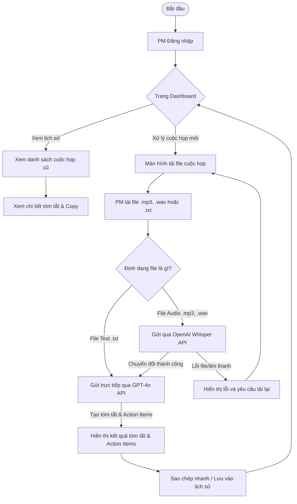

# Phân Tích Nỗi Đau & Phạm Vi (Pain And Scope) — DailyTools

## Input Used

- **Context version:** 1.0
- **Confirmed requirements:** R-1, R-2, R-3, R-4, R-5
- **Assumptions:** A-1, A-2, A-3
- **Constraints:** Thời gian bàn giao 1 - 1.5 tháng, ngân sách tối ưu.

## Pain Points (Nỗi đau của khách hàng)

| ID | Nỗi đau (Pain Point) | Bằng chứng (Evidence) | Mức độ | Giả thuyết Nguyên nhân (Root Cause) | Độ tin cậy (Confidence) |
| --- | --- | --- | --- | --- | --- |
| PP-1 | PM mất nhiều thời gian và công sức để tóm tắt cuộc họp và ghi nhận Action Items thủ công. | Ý kiến khách hàng ở file đầu vào (Client Input) | High | Không có công cụ tự động hóa việc chuyển âm thanh thành văn bản và phân tích nội dung cuộc họp. | High |

## Solution Direction (Hướng giải quyết)
Xây dựng ứng dụng Web DailyTools MVP đơn giản, dễ sử dụng. PM đăng nhập vào hệ thống và tải lên file ghi âm cuộc họp (mp3, wav) hoặc file văn bản thô (txt). 
- Đối với file ghi âm, hệ thống gọi API OpenAI Whisper để chuyển đổi thành văn bản.
- Sau đó, hệ thống sử dụng API OpenAI GPT-4o để tóm tắt các nội dung chính của cuộc họp và tự động phân loại, trích xuất danh sách công việc cần làm (Action Items) dưới dạng danh sách công việc rõ ràng.
- PM có thể sao chép văn bản tóm tắt chỉ bằng một nút bấm và xem lại lịch sử các cuộc họp đã được xử lý trên Dashboard.

## Value Mapping (Bản đồ Giá trị Kinh doanh)

| Tính năng / Giải pháp | Nỗi đau được giải quyết | Giá trị Kinh doanh mang lại | Cơ sở Bằng chứng | Ai hưởng lợi |
| :--- | :--- | :--- | :--- | :--- |
| **Đăng nhập & Quản lý tài khoản** | Bảo mật dữ liệu họp | Bảo vệ thông tin cuộc họp nội bộ của dự án, tránh rò rỉ dữ liệu. | Nguyên tắc bảo mật cơ bản | PM |
| **Tải file âm thanh/văn bản** | PP-1 | Cho phép tiếp nhận dữ liệu cuộc họp từ bất kỳ nguồn ghi âm nào một cách dễ dàng. | Logic vận hành hệ thống | PM |
| **Tích hợp Speech-to-Text (Whisper)** | PP-1 | Tiết kiệm hoàn toàn thời gian PM phải tự nghe và gõ lại nội dung cuộc họp từ file ghi âm. | Logic suy luận (nghe và chép lại thủ công thường mất thời gian gấp 3 lần độ dài cuộc họp) | PM |
| **Tích hợp Tóm tắt AI (GPT-4o)** | PP-1 | Tự động tóm tắt cuộc họp và trích xuất Action Items trong vòng dưới 1 phút thay vì 30 phút viết báo cáo thủ công. | Đánh giá hiệu suất thực tế của mô hình GPT-4o | PM |
| **Giao diện Dashboard & Sao chép nhanh** | PP-1 | Dễ dàng quản lý lịch sử họp và chia sẻ báo cáo tóm tắt cho các thành viên qua Email, Slack, Zalo nhanh chóng. | Logic quy trình làm việc | PM & Thành viên dự án |

## Scope Register (Đăng ký Phạm vi)

### In Scope (Trong Phạm vi MVP - Áp dụng MoSCoW)

| ID | Tính năng / Công việc | Maps To | Phân loại MoSCoW | Lý do |
| --- | --- | --- | --- | --- |
| S-1 | Đăng nhập & Quản lý tài khoản PM | R-3 | **Must-have** | Đảm bảo tính bảo mật và phân tách dữ liệu cuộc họp giữa các tài khoản PM. |
| S-2 | Tải file cuộc họp (mp3, wav, txt) | R-2 | **Must-have** | Kênh nhập dữ liệu cuộc họp duy nhất cho MVP. |
| S-3 | Chuyển đổi âm thanh Whisper API | R-4 | **Must-have** | Chuyển giọng nói thành văn bản để làm đầu vào cho AI tóm tắt. |
| S-4 | Tóm tắt cuộc họp & Action Items GPT-4o API | R-4 | **Must-have** | Tính năng cốt lõi mang lại giá trị chính cho PM. |
| S-5 | Dashboard danh sách & Lịch sử cuộc họp | R-1 | **Must-have** | Nơi PM xem danh sách các cuộc họp đã xử lý. |
| S-6 | Giao diện chi tiết tóm tắt cuộc họp | R-1 | **Must-have** | Hiển thị nội dung tóm tắt chi tiết và danh sách Action Items. |
| S-7 | Nút Sao chép nhanh (Copy) kết quả tóm tắt | R-1 | **Should-have** | Hỗ trợ PM chia sẻ kết quả họp nhanh cho team mà không cần bôi đen copy thủ công. |

### Out Of Scope (Ngoài Phạm vi MVP)

| ID | Tính năng / Nội dung | Lý do tạm hoãn |
| --- | --- | --- |
| O-1 | Ghi âm cuộc họp trực tiếp trên Web | Giảm thiểu rủi ro kỹ thuật liên quan đến Microphone API của trình duyệt. |
| O-2 | Bot tự động join link Zoom, Meet, Teams | Tích hợp phức tạp, vượt quá giới hạn thời gian bàn giao 1.5 tháng. |
| O-3 | Phân quyền vai trò người dùng (Member, Admin) | MVP chỉ tập trung phục vụ tối đa nhu cầu của 1 vai trò PM. |
| O-4 | Đồng bộ tự động sang Jira, Trello, Slack | Hạn chế scope creep; tính năng Sao chép nhanh (S-7) đã giải quyết tạm thời nhu cầu chia sẻ. |

### Future Phase (Giai đoạn tiếp theo)
- Phát triển Bot họp trực tuyến tự động tham gia ghi âm cuộc họp.
- Quản lý tài khoản nâng cao (phân quyền cho Member dự án xem báo cáo tóm tắt).
- Tích hợp sâu với các hệ thống quản trị dự án (Jira API, Slack API, Microsoft Teams API).

### Pending Decisions
*(Không có)*

### Scope Change Candidates
*(Không có)*

## Risks (Rủi ro & Biện pháp Giảm thiểu)

| ID | Rủi ro | Mức độ | Biện pháp giảm thiểu |
| --- | --- | --- | --- |
| Risk-1 | Chất lượng chuyển giọng nói thành văn bản (STT) thấp do file âm thanh bị ồn hoặc nói quá nhanh/nhiều người đè giọng. | Medium | Khuyến cáo chất lượng âm thanh đầu vào trên giao diện; Hỗ trợ PM sửa văn bản gốc (transcript) trước khi gửi AI tóm tắt. |
| Risk-2 | Chi phí API vượt mức dự kiến nếu PM tải lên số lượng file ghi âm quá lớn. | Low | Cấu hình giới hạn trần chi phí (spending limits) trên Dashboard API OpenAI của khách hàng. |

---

## Luồng người dùng (User Flow)

---

## Phác thảo Giao diện (High-Level Wireframe Text)

Do độ phức tạp của dự án được phân loại là **Light**, chúng tôi tối giản hóa cấu trúc màn hình và bỏ qua wireframe chi tiết trong Proposal của khách hàng. Dưới đây là mô tả bố cục thô của 2 màn hình chính để định hình thiết kế frontend:

### 1. Dashboard & Lịch sử Cuộc họp (Main Dashboard)
* **Header:** Logo DailyTools (bên trái), Thông tin tài khoản PM & Nút Đăng xuất (bên phải).
* **Sidebar:** Menu liên kết: "Dashboard" (Active) và "Tải cuộc họp mới".
* **Main Content Area:**
  * **Top Row:** Nút hành động chính "Tải cuộc họp mới" (Button màu Primary nổi bật).
  * **Table/List:** Danh sách các cuộc họp đã xử lý:
    * Cột: Tên cuộc họp (Date & Time), Định dạng (Audio/Text), Trạng thái (Thành công/Đang xử lý), Hành động (Xem chi tiết, Xóa).
  * **Pagination:** Phân trang nếu số lượng cuộc họp vượt quá 10.

### 2. Màn hình Chi tiết Tóm tắt & Kết quả (Meeting Detail View)
* **Header & Sidebar:** Đồng bộ với Dashboard chính.
* **Main Content Area:**
  * **Breadcrumb:** Dashboard / Chi tiết cuộc họp [Tên cuộc họp]
  * **Left Column (40% width):** Thông tin cuộc họp (Tên, ngày tải, độ dài âm thanh) + Ô nhập Text transcript gốc (để PM có thể chỉnh sửa thủ công nếu AI dịch sai).
  * **Right Column (60% width):**
    * **Tab 1: Tóm tắt nội dung chính (Summary):** Hiển thị văn bản dạng prose tóm tắt ngắn gọn. Nút "Sao chép nhanh" ở đầu Tab.
    * **Tab 2: Danh sách đầu việc (Action Items):** Hiển thị danh sách checkbox các task được trích xuất (Tên task | Người thực hiện nếu có). Nút "Sao chép Action Items" ở đầu Tab.
