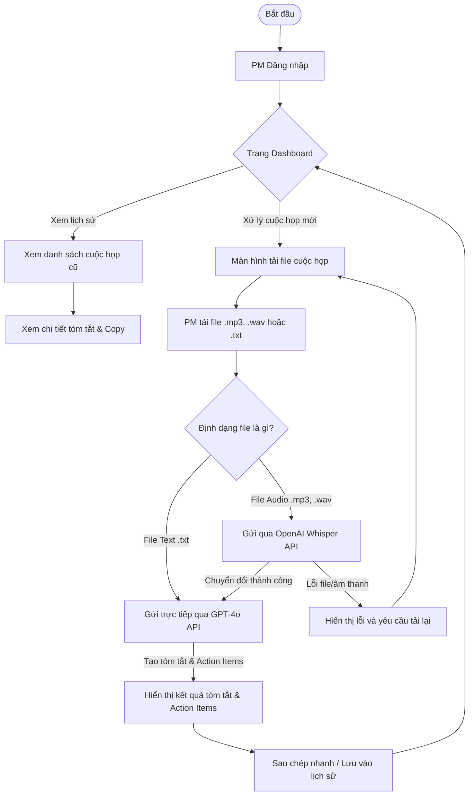

# 02 - Giải Pháp Đề Xuất & Quy Trình Trải Nghiệm

## 2.1 Tổng Quan Giải Pháp (Solution Overview)

DailyTools là ứng dụng Web responsive, tối giản, thiết kế chuyên biệt cho PM. Hệ thống tích hợp Cloud API để tự động hóa toàn bộ quy trình: tiếp nhận âm thanh cuộc họp → chuyển đổi văn bản → phân tích tóm tắt — loại bỏ hoàn toàn tác vụ hành chính thủ công.

## 2.2 Các Tính Năng Chính (Key Features)

**Đăng nhập & Bảo mật tài khoản PM**
Xác thực tài khoản cá nhân cho từng PM, mỗi người sở hữu không gian lưu trữ và quản lý cuộc họp độc lập, đảm bảo bảo mật dữ liệu dự án.

**Dashboard quản lý lịch sử họp**
Dashboard tập trung hiển thị toàn bộ cuộc họp đã xử lý. PM dễ dàng tìm kiếm, xem lại nội dung họp cũ chỉ với vài thao tác.

**Tiếp nhận dữ liệu đa định dạng (Upload Module)**
Hỗ trợ tải file âm thanh (.mp3, .wav) và văn bản thô (.txt), giúp PM linh hoạt đưa dữ liệu từ nhiều nguồn vào hệ thống.

**Chuyển đổi âm thanh tự động (Speech-to-Text)**
Tích hợp OpenAI Whisper API tự động chuyển đổi file âm thanh tiếng Việt/tiếng Anh thành văn bản thô trong vài giây với độ chính xác cao.

**Biên tập văn bản (Transcript Editor)**
Trình biên tập trực quan cho PM rà soát và chỉnh sửa văn bản thô (thuật ngữ chuyên ngành, tên riêng) trước khi gửi yêu cầu tóm tắt AI.

**Tóm tắt thông minh & Trích xuất Action Items**
Sử dụng OpenAI GPT-4o phân tích văn bản cuộc họp, xuất ra bản tóm tắt ngắn gọn và danh sách Action Items dạng checklist rõ ràng.

**Sao chép nhanh một chạm (Quick Copy)**
Nút sao chép riêng biệt cho phần Tóm tắt và Action Items, PM dán thẳng vào email, Slack, Zalo hoặc Jira.

## 2.3 Luồng Người Dùng (User Flow)

Quy trình DailyTools được tối ưu để PM đạt kết quả nhanh nhất — từ đăng nhập, tải file, chuyển đổi âm thanh và tóm tắt, đến sao chép chia sẻ.

