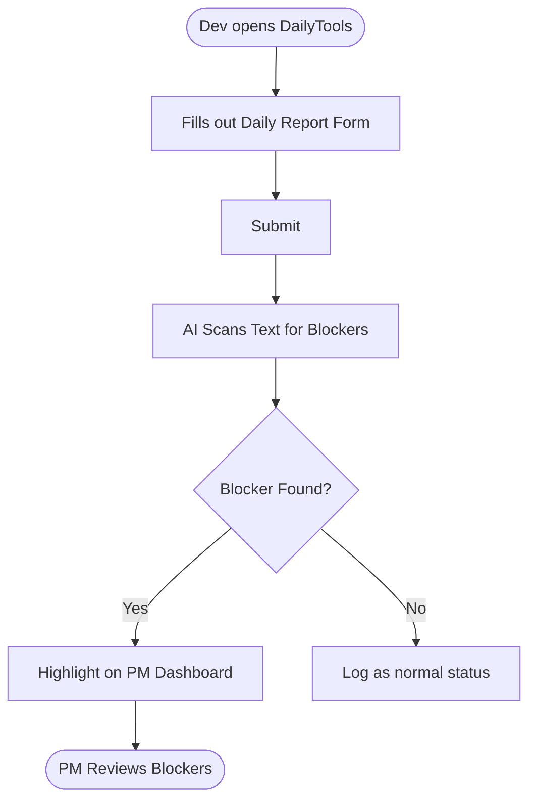

## 2. Proposed Solution & UX

### 2.1 Solution Overview
DailyTools is a centralized daily reporting hub designed to automatically identify and surface development bottlenecks. By analyzing unstructured developer updates, the system instantly flags potential risks and alerts project managers, eliminating the need for developers to manually configure complex project management tools or write long status logs.

### 2.2 Key Features
To address the primary needs of project managers and development teams, the system comprises three key modules:

**Developer Workspace**
- **Frictionless Web Form**: A clean, mobile-responsive layout allowing developers to quickly submit daily status notes—focusing on accomplishments, upcoming tasks, and challenges—without disrupting their active coding workflow.
- **Passwordless Authentication**: Quick login options (such as magic links) that eliminate username and password fatigue, encouraging consistent daily submission rates.

**AI Processing Engine**
- **Intelligent Blocker Extraction**: A natural language processing layer that automatically reads daily updates to flag implicit blocks or team dependencies, even if developers do not explicitly mark them as issues.

**Project Management Dashboard**
- **Priority Roadblock Alerts**: A centralized view that automatically promotes flagged blockers to the top of the interface, ensuring management handles high-risk dependencies immediately.

### 2.3 User Flow
Developers submit their updates via a simple three-field form. The AI engine processes the text to identify potential blockers. If an issue is flagged, it is immediately highlighted at the top of the PM Dashboard. Otherwise, the submission is categorized as a standard, on-track daily update.



### 2.4 High-Level Wireframe

**Developer Submission Form**
```text
┌─────────────────────────────────────┐
│  Daily Standup Submission           │
├─────────────────────────────────────┤
│                                     │
│  What did you accomplish yesterday? │
│  ┌─────────────────────────────┐    │
│  │                             │    │
│  └─────────────────────────────┘    │
│                                     │
│  What are you working on today?     │
│  ┌─────────────────────────────┐    │
│  │                             │    │
│  └─────────────────────────────┘    │
│                                     │
│  Any blockers? (Optional)           │
│  ┌─────────────────────────────┐    │
│  │                             │    │
│  └─────────────────────────────┘    │
│                                     │
│           [ Submit Update ]         │
└─────────────────────────────────────┘
```

**Project Manager Dashboard**
```text
┌─────────────────────────────────────┐
│  PM Management Console              │
├─────────────────────────────────────┤
│                                     │
│  Active Project Blockers (2)        │
│  ┌─────────────────────────────┐    │
│  │ * John: API timeout issue   │    │
│  │ * Mai: Waiting for design   │    │
│  └─────────────────────────────┘    │
│                                     │
│  ─────────────────────────────────  │
│                                     │
│  Today's Standup Logs               │
│  ┌─────────────────────────────┐    │
│  │ John - 10:02 AM             │    │
│  │ Did: Fixed auth module      │    │
│  │ Will: Start API integration │    │
│  │ Blocker: API timeout        │    │
│  ├─────────────────────────────┤    │
│  │ Mai - 09:45 AM              │    │
│  │ Did: Completed wireframes   │    │
│  │ Will: Build prototype       │    │
│  │ Blocker: Waiting on design  │    │
│  └─────────────────────────────┘    │
│                                     │
└─────────────────────────────────────┘
```
