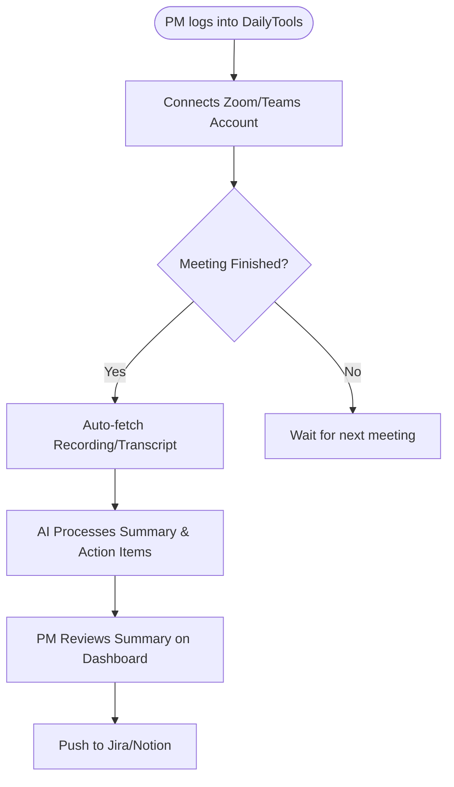

## 3. Solution Approach

### 3.1 Risk & Mitigation
| # | Risk | Severity | Impact | Mitigation |
|:--|:-----|:--------:|:-------|:-----------|
| R1 | Privacy of meeting data | High | Potential data leak of sensitive discussions | End-to-end encryption and strict data retention policies (delete after processing). |
| R2 | AI summary inaccuracy | Medium | Incorrect tasks or decisions captured | "Human-in-the-loop" review step in the PM dashboard before syncing to Jira/Notion. |
| R3 | API breaking changes | Low | System downtime for integrations | Modular integration design with robust error handling and manual fallback support. |

### 3.2 Acceptance Criteria
| # | Item | Measurement Criteria | Phase |
|:--|:-----|:---------------------|:------|
| AC1 | Meeting Fetch | System successfully retrieves recordings from Zoom/Teams 100% of the time. | Phase 1 |
| AC2 | Summary Quality | 85%+ of generated action items are rated "Accurate" by PMs in UAT. | Phase 2 |
| AC3 | Sync Reliability | Summaries are pushed to Jira/Notion without data loss or formatting errors. | Phase 3 |
| AC4 | Time Optimization | PMs report at least 50% time reduction in meeting documentation tasks. | Phase 4 |

### 3.3 Visualizing Solution

#### User Flow

#### High-Level Wireframe
- **Dashboard Screen**:
  - **Header**: User profile, Settings, Sync status.
  - **Sidebar**: Recent Meetings, Integrations configs.
  - **Main Content**: List of recently processed meetings with a "Review" button.
  - **Review Modal**: Shows AI-generated summary, action items (editable), and "Push to Jira" button.
