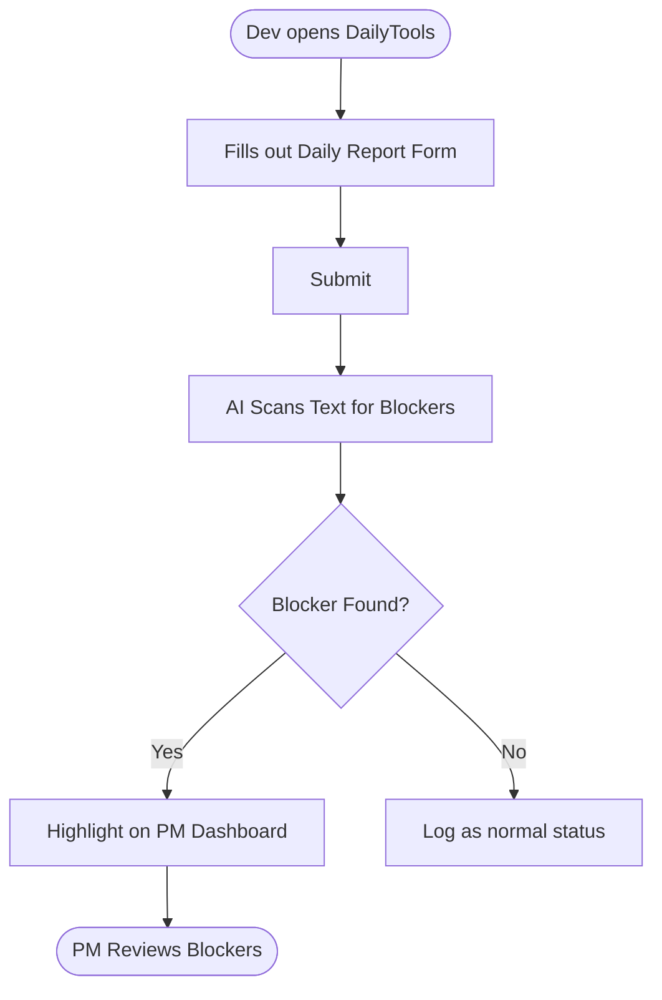

## 3. User Flow & Wireframe

### 3.1 User Flow
Developers submit daily reports through a simple web form. The AI engine scans each submission for blockers. If a blocker is detected, it is highlighted on the PM Dashboard for immediate action. Otherwise, the report is logged as a normal status update.

### 3.2 High-Level Wireframe
- **Dev Form**: Three fields — What I did, What I will do, Blockers (Optional). Single submit button.
- **PM Dashboard**: Active Blockers alert section at the top, followed by a chronological list of standard daily updates.
