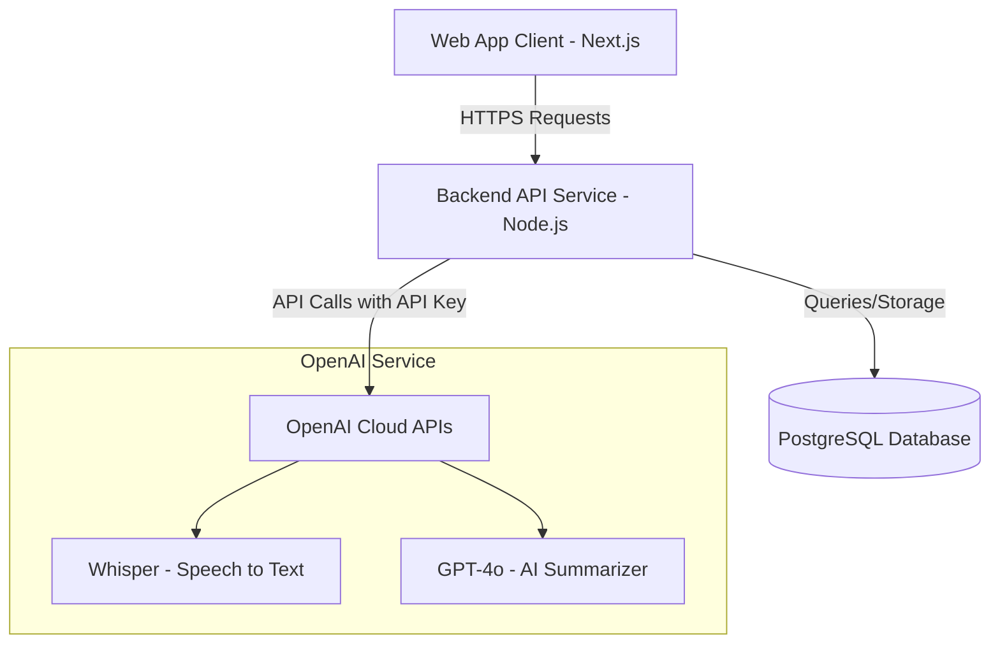
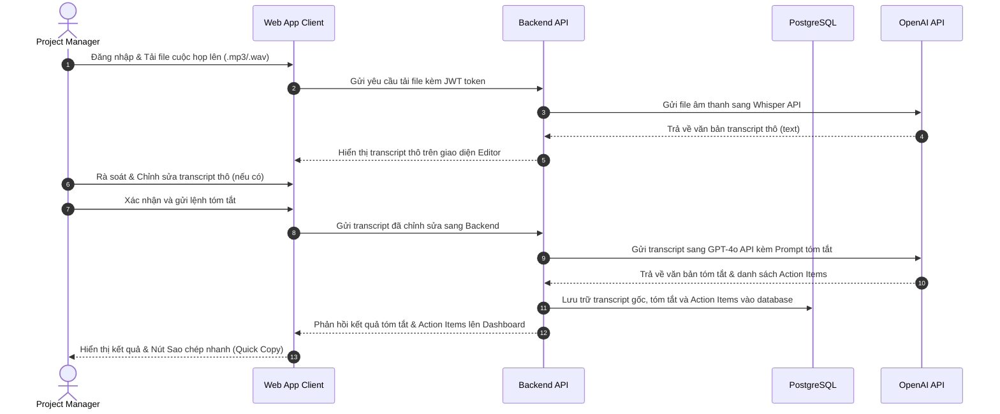

# 05 - Kiến Trúc Kỹ Thuật Sơ Bộ

## 5.1 Kiến Trúc Mục Tiêu (Target Architecture)

Hệ thống được thiết kế theo kiến trúc Client-Server tối giản và hiệu quả. Ứng dụng Web tương tác trực tiếp với người dùng và gửi yêu cầu thông qua kết nối bảo mật tới Backend API. API Service chịu trách nhiệm xử lý nghiệp vụ, lưu trữ cơ sở dữ liệu và đóng vai trò cổng kết nối (Gateway) điều phối cuộc gọi tới các API OpenAI.

## 5.2 Công Nghệ Lựa Chọn (Tech Stack)

Để tối ưu hóa thời gian phát triển trong vòng 1-1.5 tháng và đảm bảo chất lượng, đội ngũ đề xuất các công nghệ sau:
- **Frontend Framework:** React.js & Next.js giúp xây dựng giao diện responsive nhanh chóng, hỗ trợ render phía máy chủ tốt và tối ưu hóa trải nghiệm tương tác của PM.
- **Backend Framework:** Node.js & Express.js cung cấp môi trường chạy gọn nhẹ, xử lý bất đồng bộ tối ưu khi tương tác với các API AI thời gian thực và đồng bộ tốt với Javascript của Frontend.
- **Cơ sở dữ liệu (Database):** PostgreSQL là hệ quản trị cơ sở dữ liệu quan hệ mã nguồn mở mạnh mẽ, đảm bảo tính toàn vẹn dữ liệu tài khoản và lưu trữ văn bản tóm tắt có cấu trúc an toàn.
- **Trí tuệ nhân tạo (AI Engine):** OpenAI API (Whisper & GPT-4o) được sử dụng để chuyển đổi giọng nói tiếng Việt/tiếng Anh và tóm tắt cuộc họp với chất lượng tối ưu nhất hiện nay mà không mất chi phí nghiên cứu phát triển mô hình riêng.
- **Hạ tầng triển khai (Hosting & Cloud):** Vercel (dành cho Frontend) và AWS EC2/RDS (dành cho Backend & Database) giúp giảm thiểu tối đa chi phí vận hành ban đầu và cung cấp cơ chế CI/CD tự động hóa việc deploy.

## 5.3 Luồng Dữ Liệu Xử Lý (Data Flow)

Luồng dữ liệu xử lý một file ghi âm từ khi PM tải lên cho đến khi lưu trữ kết quả tóm tắt cuối cùng:

## 5.4 Quy Mô & Dung Lượng (Capacity & Sizing)

Hệ thống được thiết kế phù hợp với nhu cầu sử dụng thực tế của một doanh nghiệp nhỏ:
- **Người dùng hoạt động:** Phục vụ từ 1 đến 5 PM sử dụng đồng thời hàng ngày để quản trị các dự án.
- **Tải trọng đồng thời:** Hệ thống hỗ trợ xử lý từ 2 đến 3 file ghi âm tải lên cùng một thời điểm mà không gây nghẽn băng thông.
- **Chiến lược lưu trữ:** File âm thanh sau khi được Whisper chuyển đổi thành công sang văn bản sẽ được tự động xóa khỏi bộ nhớ đệm của server để giải phóng dung lượng và tối ưu hóa chi phí lưu trữ đĩa cứng. Hệ thống chỉ lưu trữ văn bản transcript gốc và kết quả tóm tắt dạng text trong PostgreSQL Database.

## 5.5 Bảo Mật & Riêng Tư (Security & Privacy)

Dữ liệu cuộc họp là tài sản nhạy cảm của doanh nghiệp, do đó bảo mật được đặt lên hàng đầu:
- **Mã hóa đường truyền:** Toàn bộ dữ liệu truyền đi giữa Client, Backend và các dịch vụ OpenAI đều được mã hóa bằng giao thức HTTPS với chuẩn bảo mật TLS 1.3.
- **Quản lý phiên làm việc:** Sử dụng cơ chế JSON Web Token (JWT) lưu trữ ở client với thời gian hết hạn ngắn (ví dụ: 24 giờ) để ngăn chặn việc đánh cắp session.
- **Bảo mật khóa API bên thứ ba:** Khóa API OpenAI được lưu trữ an toàn trong biến môi trường (Environment Variables) phía Backend API. Client tuyệt đối không có quyền truy cập trực tiếp vào API Key này để tránh rò rỉ hoặc lạm dụng.
