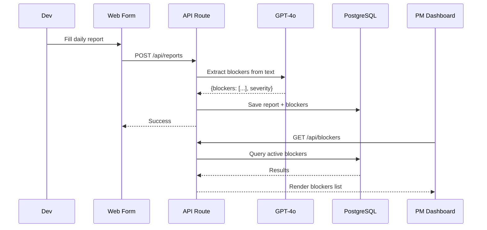

## 5. Technical Architecture

### 5.1 Target Architecture
DailyTools uses a simple Next.js monolithic architecture for rapid MVP delivery.

```text
┌─ CLIENT (Next.js / React) ───────────────┐
│  ┌──────────────┐  ┌──────────────────┐  │
│  │ Dev Report   │  │ PM Dashboard     │  │
│  │ Form         │  │ (Blockers View)  │  │
│  └──────────────┘  └──────────────────┘  │
└──────────────────────────────────────────┘
              │
              ▼
┌─ API (Next.js API Routes) ───────────────┐
│  [Auth]  [Submit Report]  [Get Blockers] │
└──────────────────────────────────────────┘
              │
              ▼
┌─ SERVICE ────────────────────────────────┐
│  ┌─────────────────────────────────────┐ │
│  │ AI Blocker Extraction (GPT-4o)     │ │
│  │ • Scan text for hidden blockers    │ │
│  │ • Classify severity                │ │
│  └─────────────────────────────────────┘ │
└──────────────────────────────────────────┘
              │
              ▼
┌─ DATA (PostgreSQL / Supabase) ───────────┐
│  • reports    • blockers    • users      │
└──────────────────────────────────────────┘
```

### 5.2 Tech Stack
| Layer | Technology | Role | Why |
|:------|:-----------|:-----|:----|
| Fullstack | Next.js / TypeScript | Unified frontend and backend API | Rapid MVP delivery with single codebase, SSR for fast load |
| AI / NLP | OpenAI GPT-4o | Text analysis and blocker extraction | Best-in-class text understanding, low integration effort |
| Database | PostgreSQL (Supabase) | Data storage | Managed service, built-in auth, real-time subscriptions |
| Hosting | Vercel | Zero-config deployment | Native Next.js support, serverless scaling, free tier for MVP |

### 5.3 Data Flow



### 5.4 Capacity Planning & Infrastructure Sizing
#### Traffic Estimation
| Metric | Value | Calculation |
|:-------|:------|:------------|
| Avg Reports / Day | 50 | Initial dev team size |
| Storage / Report | < 5KB | Plain text data |
| Daily Data Volume | < 1MB | Extremely lightweight |

#### Infrastructure Sizing
- **Compute**: Next.js Serverless functions (Vercel).
- **Storage**: None needed beyond the database.
- **Database**: PostgreSQL (Supabase/Vercel Postgres) for text logs.
