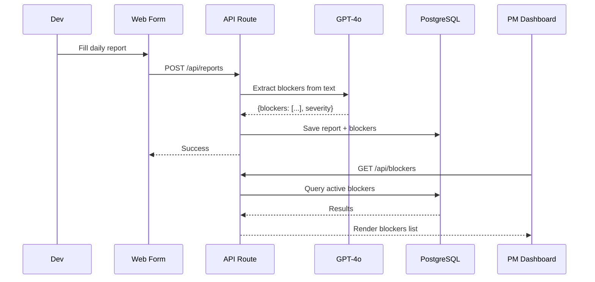

## 5. Technical Architecture

> 💡 DailyTools uses a modern, serverless Next.js monolithic architecture for rapid MVP delivery, ensuring low cost and high scalability.

### 5.1 Target Architecture
```text
┌─ CLIENT (Next.js / React) ───────────────┐
│  ┌──────────────┐  ┌──────────────────┐  │
│  │ Dev Report   │  │ PM Dashboard     │  │
│  │ Form         │  │ (Blockers View)  │  │
│  └──────────────┘  └──────────────────┘  │
└──────────────────────────────────────────┘
              │
              ▼
┌─ API (Next.js API Routes) ───────────────┐
│  [Auth]  [Submit Report]  [Get Blockers] │
└──────────────────────────────────────────┘
              │
              ▼
┌─ SERVICE ────────────────────────────────┐
│  ┌─────────────────────────────────────┐ │
│  │ AI Blocker Extraction (GPT-4o)     │ │
│  │ • Scan text for hidden blockers    │ │
│  │ • Classify severity                │ │
│  └─────────────────────────────────────┘ │
└──────────────────────────────────────────┘
              │
              ▼
┌─ DATA (PostgreSQL / Supabase) ───────────┐
│  • reports    • blockers    • users      │
└──────────────────────────────────────────┘
```

### 5.2 Tech Stack
- **Frontend & Backend**: **Next.js / TypeScript** — Single codebase for both UI and API routes. Rapid MVP delivery, SSR for fast load times.
- **AI Engine**: **OpenAI GPT-4o** — Best-in-class understanding for text analysis and blocker extraction with low integration effort.
- **Database & Auth**: **PostgreSQL (Supabase)** — Managed service, built-in auth (JWT), real-time subscriptions, free tier is fully sufficient for MVP.
- **Infrastructure**: **Vercel** — Zero-config deployment, native Next.js support, serverless auto-scaling.

### 5.3 Data Flow


### 5.4 Capacity & Sizing
- **Target Users**: ~50 Developers.
- **Concurrent Connections**: Low. ~50 reports/day, each report <5KB. Total storage <1MB/day.
- **Storage Strategy**: Relational storage in Supabase PostgreSQL is more than enough. The entire system will run comfortably on free/hobby tiers until scaling past 200+ users.

### 5.5 Security & Privacy
- **Transport**: TLS 1.3 (Vercel default).
- **Storage**: AES-256 encryption (Supabase default).
- **Auth**: Supabase Auth (JWT) with RBAC (Dev = submit only, PM = read dashboard).
- **LLM Privacy**: Zero-retention API — OpenAI does not store or train on input data. Report text will be anonymized before sending to GPT-4o.
