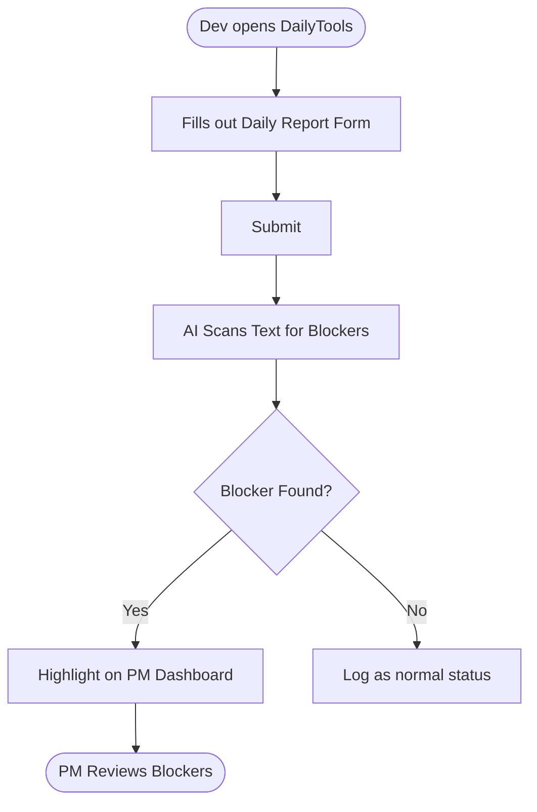

# Pain and Scope: DailyTools

## Input Used

- Context version: 1.0
- Confirmed requirements: REQ004, REQ007, REQ008
- Constraints: Focus on simplest MVP trial.

## Pain Points

| ID | Pain Point | Evidence | Impact | Root Cause Hypothesis | Confidence |
| --- | --- | --- | --- | --- | --- |
| PP001 | Lack of visibility into dev blockers | Client Pivot | PMs miss critical issues | Daily reports are too long or not structured | High |
| PP002 | Manual parsing of updates | Best practice | PMs waste time reading | Devs write unstructured text | High |

## Solution Direction

DailyTools will provide a lightweight Web Form for developers to submit their daily reports. A text-based AI engine will automatically scan these reports to extract and highlight any "Blockers" or risks, displaying them prominently on a PM Dashboard for immediate action.

## Scope Register

### In Scope

| ID | Item | Priority (MoSCoW) | Maps To | Reason |
| --- | --- | --- | --- | --- |
| SCOPE006 | Web Form for Dev Daily Reports | Must-have | REQ007 | Source of text data |
| SCOPE007 | AI Blockers Extraction | Must-have | REQ008 | Core MVP value |
| SCOPE008 | PM Dashboard for Blockers | Must-have | REQ004 | Admin view for PMs |

### Out Of Scope

| ID | Item | Reason |
| --- | --- | --- |
| SCOPE004 | Real-time live transcription | Irrelevant to text-based MVP |
| SCOPE005 | Jira/Notion Sync | Deferred to Phase 2 to keep MVP simple |

### Future Phase

| ID | Item | Reason |
| --- | --- | --- |
| SCOPE001 | Meeting platform integrations (Zoom/Teams) | Deferred per Client Pivot |
| SCOPE002 | AI Voice Summarization Engine | Deferred per Client Pivot |
| SCOPE003 | Jira & Notion API Export | Deferred per Client Pivot |
| SCOPE009 | Multi-language Support | Focus on English/Vietnamese for MVP |

### Pending Decisions

| ID | Decision Needed | Impact |
| --- | --- | --- |
| Q004 | Target timeline for MVP | Affects feature prioritization and resource planning |

## Scope Change Candidates

*None at this stage.*

## Risks

| ID | Risk | Severity | Mitigation |
| --- | --- | --- | --- |
| RSK003 | Low adoption by devs | High | Make the form ultra-fast (3 fields) |
| RSK001 | AI missing hidden blockers | Medium | Allow devs to explicitly tag blockers |

## Visualizing Solution (User Flow & Mockups)

### User Flow

### High-Level Wireframe
- **Dev Form**:
  - **Fields**: What I did, What I will do, Blockers (Optional).
- **PM Dashboard**:
  - **Header**: Project selection, Date.
  - **Main Content**: A prominent "Active Blockers" alert section showing issues extracted by AI, followed by a list of standard daily updates.
