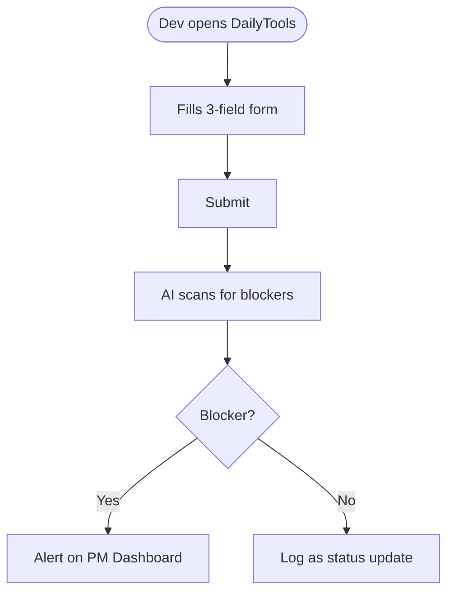

# DailyTools MVP

**Proposal Presentation**
Antigravity AI | May 2026

<!-- Speaker notes: Introduce yourself, set context — this is a lightweight MVP proposal for automated blocker detection -->

---

## The Problem

- **No visibility into blockers** — Daily reports are too long, unstructured, buried in chat
- **Manual parsing** — PMs spend 30–60 min/day reading Slack just to find issues

> If a blocker is missed for 1 day, it can become a 1-week delay.

<!-- Speaker notes: Ask client to confirm — "Is this what your PMs experience?" -->

---

## Our Solution

A lightweight web app that collects dev daily updates and uses AI to instantly surface hidden blockers.

**Key Features:**
- **Frictionless Daily Log** — 3-field form, done in 30 seconds
- **Smart Blocker Detection** — AI reads between the lines, flags risks automatically
- **Alert Dashboard** — PMs see blockers at a glance, no manual parsing

<!-- Speaker notes: Emphasize "zero disruption to dev workflow" and "PM gets instant visibility" -->

---

## How It Works



<!-- Speaker notes: Walk through the happy path — dev submits, AI processes, PM sees result -->

---

## Architecture

```text
┌─ CLIENT (Next.js) ──────────────────┐
│  Dev Form  │  PM Dashboard          │
└─────────────────────────────────────┘
              │
              ▼
┌─ API ───────────────────────────────┐
│  Auth  │  Submit  │  Get Blockers   │
└─────────────────────────────────────┘
              │
              ▼
┌─ AI SERVICE (GPT-4o) ───────────────┐
│  Scan text → Extract blockers       │
└─────────────────────────────────────┘
              │
              ▼
┌─ DATABASE (Supabase / PostgreSQL) ──┐
│  reports  │  blockers  │  users     │
└─────────────────────────────────────┘
```

<!-- Speaker notes: Simple monolith — fast to build, easy to maintain. Can evolve in Phase 2 -->

---

## Tech Stack

- **Frontend & Backend**: Next.js / TypeScript — single codebase, fast delivery
- **AI Engine**: OpenAI GPT-4o — best-in-class text understanding
- **Database & Auth**: Supabase (PostgreSQL) — managed, built-in auth
- **Hosting**: Vercel — zero-config, serverless, free tier for MVP

<!-- Speaker notes: All choices optimized for speed-to-market and low operational cost -->

---

## Roadmap

| Phase | What | When |
|-------|------|------|
| P1 | Dev Form & Database | Week 1 |
| P2 | AI Blocker Engine | Week 2 |
| P3 | PM Dashboard | Week 3 |
| P4 | UAT & Launch | Week 4 |

**Total: 4 weeks to live MVP**

<!-- Speaker notes: Weekly demos — client sees progress every Friday -->

---

## Team & Investment

**Team**: 1 Fullstack Dev + 0.3 AI Engineer + 0.2 QA
**Effort**: 112 hours total
**Timeline**: 4 weeks

**Pricing**: Fixed-price, milestone-based
**Monthly OpEx**: $5–60/month (free tier covers MVP)

<!-- Speaker notes: Extremely lean — low risk, low cost, high learning value -->

---

## Payment Schedule

- **30%** upon contract signing (kick-off)
- **30%** upon AI engine delivery (Week 2)
- **40%** upon UAT sign-off & launch (Week 4)

<!-- Speaker notes: Tied to deliverables, not time. Client pays for results -->

---

## What's Next (Phase 2)

If MVP succeeds (adoption >70%, accuracy ≥90%):

- **Slack/Teams integration** — submit via slash command
- **Jira/Notion sync** — auto-create tickets from blockers
- **Trend analytics** — weekly blocker trends, team health score
- **Self-hosted LLM** — eliminate 3rd-party data dependency

**Phase 2 estimate**: 9–12 weeks

<!-- Speaker notes: Show long-term vision. MVP is the proof point -->

---

## Next Steps

1. **Approve** this proposal
2. **Kick-off** meeting within 1 week of signing
3. **First demo** (working form): end of Week 1

**Let's build it.**

<!-- Speaker notes: Clear CTA — ask for sign-off or feedback. Propose kick-off date -->
