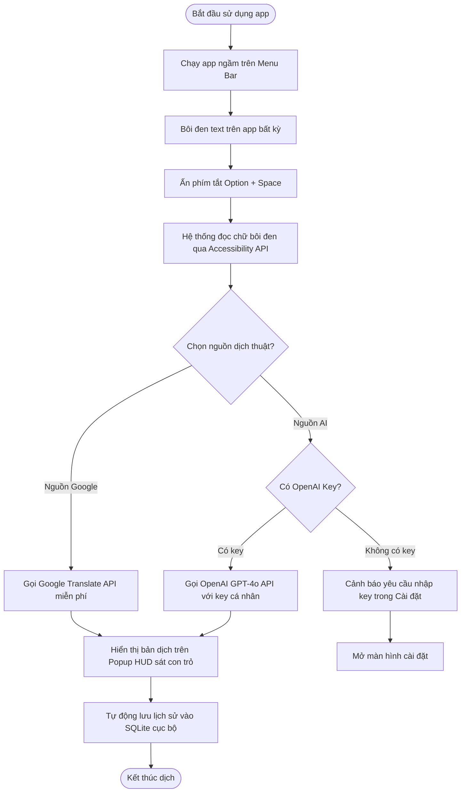
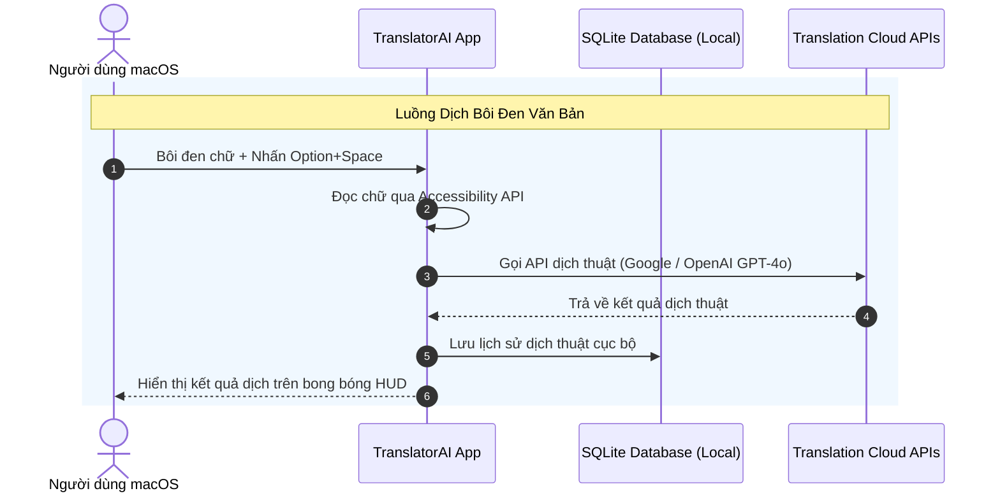

# Đề Xuất Giải Pháp: TranslatorAI macOS App MVP
**Tác giả**: Ryan Nguyen
**Ngày**: 2026-05-22
**Phiên bản**: Final
**Trạng thái**: Approved

# 01 - Tổng Quan Dự Án & Giá Trị Kinh Doanh

## 1.1 Bối Cảnh & Vấn Đề (Context & Problem Statement)

Người dùng macOS thường xuyên phải dịch thuật văn bản khi đọc tài liệu, làm việc trên các ứng dụng như Slack, Zalo, WeChat hoặc trình duyệt, đòi hỏi phải chuyển đổi qua lại giữa các cửa sổ ứng dụng và trang web dịch thuật liên tục, gây gián đoạn công việc sâu. Ngoài ra, việc bảo mật các tài liệu nội bộ nhạy cảm khi dịch thuật vẫn còn gặp nhiều rào cản.

Các vấn đề cốt lõi:
- Gián đoạn luồng làm việc liên tục: Việc sao chép và chuyển đổi tab để dịch văn bản thô làm giảm hiệu suất và sự tập trung đáng kể.
- Rủi ro bảo mật dữ liệu nhạy cảm: Việc gửi toàn bộ dữ liệu dịch lên các máy chủ đám mây của bên thứ ba tăng nguy cơ rò rỉ thông tin mật của cá nhân và doanh nghiệp.

## 1.2 Mục Tiêu & Tác Động Kinh Doanh (Goals & Business Impact)

Dự án TranslatorAI hướng tới xây dựng một ứng dụng native gọn nhẹ trên hệ điều hành macOS, hỗ trợ phím tắt toàn hệ thống để dịch tức thời tại chỗ dạng in-place mà không gửi dữ liệu ra ngoài thiết bị.

Loại hình dự án: Phát triển sản phẩm mới (Native macOS Greenfield MVP).

Lợi ích kinh doanh:
- Tiết kiệm 90% thời gian thao tác dịch thuật: Người dùng nhận kết quả dịch ngay sát con trỏ chuột trong vòng chưa đầy 1 giây mà không cần chuyển ứng dụng.
- Bảo mật thông tin tuyệt đối: Dữ liệu lịch sử lưu trữ SQLite cục bộ và cơ chế gọi API trực tiếp giúp ngăn chặn hoàn toàn rủi ro rò rỉ thông tin mật.

# 02 - Giải Pháp Đề Xuất & Quy Trình Trải Nghiệm

## 2.1 Tổng Quan Giải Pháp (Solution Overview)

TranslatorAI là ứng dụng native chạy ngầm trên thanh Menu Bar của macOS, được thiết kế tối giản nhằm cung cấp trải nghiệm dịch thuật tức thời tại chỗ cho người dùng. Ứng dụng tích hợp phím tắt toàn hệ thống để lấy văn bản bôi đen và kết nối linh hoạt với cả Google Translate lẫn trí tuệ nhân tạo OpenAI GPT-4o. Bằng cách lưu trữ dữ liệu hoàn toàn trong cơ sở dữ liệu SQLite cục bộ, TranslatorAI đảm bảo tính bảo mật và quyền riêng tư tuyệt đối cho mọi tài liệu của người dùng.

## 2.2 Các Tính Năng Chính (Key Features)

**Kiến trúc Menu Bar gọn nhẹ**
Ứng dụng chạy ngầm trên thanh trạng thái Menu Bar của macOS giúp tối ưu hóa tài nguyên hệ thống, giữ RAM tĩnh ở mức cực thấp và sẵn sàng kích hoạt bất cứ lúc nào.

**Lắng nghe phím tắt toàn cục**
Tự động bắt sự kiện phím tắt toàn hệ thống để kích hoạt nhanh bong bóng dịch mà không cần chuyển đổi ứng dụng đang làm việc.

**Bong bóng dịch thuật HUD thông minh**
Hiển thị kết quả dịch ngay sát vị trí con trỏ chuột dưới dạng popover mờ (Acrylic overlay), tự động biến mất khi người dùng click ra ngoài để tránh gây gián đoạn luồng làm việc.

**Tích hợp đa nguồn dịch thuật**
Hỗ trợ dịch nhanh miễn phí qua Google Translate hoặc dịch nâng cao bằng OpenAI GPT-4o sử dụng API Key cá nhân của người dùng nhằm dịch thuật ngữ chuyên ngành chuẩn xác nhất.

**Quản lý lịch sử SQLite cục bộ**
Tự động lưu lại tất cả lịch sử dịch thuật dưới dạng cơ sở dữ liệu SQLite mã hóa dưới máy, cho phép tra cứu nhanh hoặc xóa hoàn toàn lịch sử ngay trên ứng dụng.

**Giao diện cài đặt trực quan (Preferences)**
Hỗ trợ người dùng dễ dàng cấu hình API Key OpenAI, tùy chỉnh tổ hợp phím tắt kích hoạt nhanh, chọn model AI và bật/tắt chức năng tự động lưu lịch sử dịch thuật.

## 2.3 Luồng Người Dùng (User Flow)

Quy trình sử dụng TranslatorAI được thiết kế tối giản nhằm mang lại trải nghiệm dịch thuật tức thời thông qua thao tác phím tắt nhanh và xử lý cục bộ an toàn.



# 03 - Phạm Vi Dự Án

## 3.1 Trong Phạm Vi Phát Triển (In-Scope)

- **Kiến trúc Native Menu Bar App:** Ứng dụng native chạy ẩn dưới dạng biểu tượng Menu Bar hệ thống trên macOS 14+.
- **Hệ thống phím tắt toàn cục:** Thiết lập lắng nghe các tổ hợp phím tắt từ bất kỳ ứng dụng nào đang mở trên màn hình để khởi động nhanh chức năng dịch thuật.
- **Bong bóng Popup HUD:** Hiển thị kết quả dịch ngay cạnh con trỏ chuột với giao diện mờ, tự biến mất khi nhấp chuột ra ngoài.
- **Kết nối API dịch thuật:** Gọi API Google Translate miễn phí hoặc API OpenAI GPT-4o sử dụng khóa API cá nhân của người dùng để nhận kết quả dịch.
- **Lưu trữ SQLite cục bộ:** Khởi tạo cơ sở dữ liệu SQLite dưới máy người dùng để lưu và quản lý lịch sử bản dịch một cách an toàn.
- **Giao diện Cài đặt (Preferences View):** Cung cấp các tab cấu hình OpenAI API key, quản lý lịch sử dịch và thiết lập tổ hợp phím tắt.

## 3.2 Ngoài Phạm Vi Phát Triển (Out-of-Scope)

- **Đồng bộ đám mây (Cloud Sync):** Không hỗ trợ đồng bộ hóa lịch sử dịch thuật giữa các thiết bị thông qua máy chủ đám mây để đảm bảo an toàn thông tin tối đa.
- **Cung cấp OpenAI API Key miễn phí:** Không phát triển hệ thống chia sẻ hay tự cấp API key OpenAI miễn phí cho người dùng nhằm kiểm soát chi phí hạ tầng.

## 3.3 Kế Hoạch Phát Triển Tương Lai (Future Phase)

- **Module Chụp vùng màn hình & Quét chữ OCR offline (FP-3):** Tích hợp Apple Vision Framework để nhận diện ký tự từ ảnh chụp màn hình trực tiếp mà không cần internet.
- **Trình chỉnh sửa văn bản gốc trực tiếp trên Popup (FP-4):** Cho phép sửa văn bản gốc trực tiếp ngay trên Popup HUD trước khi bấm dịch để sửa lỗi nhận diện của OCR.
- **Phiên bản Windows OS (FP-1):** Phát triển phiên bản tương thích với hệ điều hành Windows.
- **Dịch thuật giọng nói thời gian thực (Speech-to-Speech) (FP-2):** Hỗ trợ dịch giọng nói trực tiếp từ microphone.

# 04 - Giả Định Chiến Lược & Quản Trị Rủi Ro

## 4.1 Giả Định Chiến Lược (Strategic Assumptions)

- **Tài khoản OpenAI:** Người dùng tự cung cấp API Key OpenAI cá nhân và chịu trách nhiệm chi trả mọi chi phí phát sinh từ việc gọi API GPT-4o.
- **Tính ổn định của Google Translate API:** API dịch thuật miễn phí của Google Translate thông qua các thư viện wrapper hoạt động ổn định và không bị chặn IP hàng loạt trong tương lai gần.
- **Hệ điều hành tối thiểu:** Hệ điều hành mục tiêu tối thiểu là macOS 14+ (Sonoma) để có sự hỗ trợ tốt nhất cho các API native và SwiftUI mới nhất.
- **Phân phối ứng dụng:** Khách hàng sở hữu tài khoản Apple Developer để ký số (Code Sign) và thực hiện quy trình phê duyệt Notarization từ Apple khi phát hành bản phân phối .dmg.

## 4.2 Rủi Ro & Biện Pháp Giảm Thiểu (Risk & Mitigation)

**Người dùng từ chối hoặc gặp khó khăn khi cấp quyền bảo mật hệ thống (Mức độ: Cao)**
Hệ điều hành macOS thắt chặt chính sách bảo mật, yêu cầu người dùng phải tự cấp quyền Accessibility (Trợ năng) thủ công để sử dụng tính năng phím tắt toàn cục dịch bôi đen.
*Biện pháp:* Thiết kế màn hình Onboarding hướng dẫn bằng hình ảnh động trực quan ngay khi mở ứng dụng lần đầu, chỉ dẫn chi tiết từng bước bật quyền trong System Settings.

**Giới hạn tốc độ kết nối internet khi gọi API dịch thuật (Mức độ: Thấp)**
Kết nối mạng bị gián đoạn hoặc API Google/OpenAI phản hồi chậm sẽ làm gián đoạn trải nghiệm dịch tức thời.
*Biện pháp:* Hiển thị trạng thái kết nối mạng trực quan trên bong bóng HUD và thiết lập cơ chế timeout hợp lý để thông báo lỗi rõ ràng thay vì để ứng dụng bị treo.

# 05 - Kiến Trúc Kỹ Thuật Sơ Bộ

## 5.1 Kiến Trúc Mục Tiêu (Target Architecture)

TranslatorAI được thiết kế theo kiến trúc local-first (ưu tiên xử lý cục bộ) tối giản. Ứng dụng chạy native trên macOS đóng vai trò điều phối tất cả các tương tác người dùng, lắng nghe phím tắt và thực hiện gọi dịch thuật cục bộ hoặc đám mây. Các kết nối mạng chỉ được thiết lập trực tiếp từ máy người dùng đến máy chủ API của Google hoặc OpenAI để thực hiện dịch thuật mà không đi qua bất kỳ máy chủ trung gian nào.

```mermaid
graph TD
    subgraph macOS Device (Xử lý Cục bộ)
        MenuApp[Menu Bar status item] <--> Controller[Main Application Controller]
        Hotkey[Global Hotkey listener] -->|Trigger event| Controller
        Controller -->|Lấy chữ bôi đen| AccessAPI[Accessibility API]
        AccessAPI -->|Văn bản gốc| HUD[Floating Popup HUD Overlay]
        Controller <--> HUD
        HUD <--> DB[(SQLite Database)]
    end
    
    subgraph Cloud Services (Đám mây)
        HUD -->|Request dịch thuật| GoogleAPI[Google Translate Web API]
        HUD -->|Request dịch AI với Key cá nhân| OpenAI[OpenAI GPT-4o API]
    end
```

## 5.2 Công Nghệ Lựa Chọn (Tech Stack)

Để tối ưu hóa hiệu năng native và bảo mật trên hệ điều hành macOS, đội ngũ phát triển đề xuất các công nghệ sau:
- **Frontend / Client Framework:** Swift & SwiftUI (macOS 14+ Sonoma) giúp xây dựng giao diện native mượt mà, phản hồi tức thời, sử dụng tài nguyên hệ thống (CPU, RAM) cực kỳ tối ưu và tận dụng tốt các API SwiftUI hiện đại.
- **Cơ sở dữ liệu (Database):** SQLite (Local file) là hệ quản trị cơ sở dữ liệu quan hệ cục bộ nhỏ gọn, được tích hợp sẵn trên macOS, lưu trữ lịch sử dịch thuật trực tiếp trên ổ đĩa máy tính người dùng mà không cần cài đặt dịch vụ DB chạy ngầm.
- **Cổng phím tắt & Sự kiện:** AppKit (NSGlobalEventMonitor) và Accessibility APIs giúp lắng nghe phím tắt toàn cục và trích xuất chữ được bôi đen từ các ứng dụng đang hoạt động một cách chính xác.
- **Trí tuệ nhân tạo (AI Engine) & Nguồn dịch:** Google Translate API Wrapper (miễn phí, gọi trực tiếp) và OpenAI GPT-4o API (thông qua Swift OpenAPI Generator client) hỗ trợ đa dạng hóa phương thức dịch từ cơ bản đến nâng cao.

## 5.3 Luồng Dữ Liệu Xử Lý (Data Flow)

Luồng xử lý dữ liệu dịch thuật của ứng dụng tập trung vào nhánh Dịch bôi đen văn bản trực tiếp.



## 5.4 Quy Mô & Dung Lượng (Capacity & Sizing)

Hệ thống được tối ưu hóa cho môi trường chạy đơn lập cục bộ trên từng máy cá nhân:
- **Người dùng hoạt động:** Ứng dụng chạy client-side đơn lẻ trên máy cá nhân, do đó không giới hạn số lượng người dùng đồng thời trên toàn hệ thống vì không sử dụng máy chủ chia sẻ tài nguyên.
- **Tải trọng CPU/RAM:** Mức tiêu hao RAM tĩnh khi chạy ngầm dưới 30MB; khi thực hiện dịch thuật peak CPU dưới 5% (trên chip Apple Silicon M1 trở lên) đảm bảo không gây nóng máy hay sụt pin.
- **Chiến lược lưu trữ:** Dữ liệu lịch sử dịch dạng text được SQLite nén tối ưu, ước tính 1,000 bản ghi lịch sử chỉ chiếm khoảng dưới 2MB dung lượng bộ nhớ.

## 5.5 Bảo Mật & Riêng Tư (Security & Privacy)

TranslatorAI đặt quyền riêng tư của dữ liệu người dùng làm mục tiêu thiết kế cốt lõi:
- **Bảo mật dữ liệu dịch:** 100% dữ liệu văn bản gốc và bản dịch được xử lý tại local hoặc truyền trực tiếp từ máy người dùng đến máy chủ API của Google/OpenAI, hoàn toàn không qua máy chủ trung gian của nhà phát triển.
- **Bảo mật khóa API:** API Key OpenAI cá nhân của người dùng được lưu trữ an toàn trong macOS Keychain sử dụng Apple Security framework, đảm bảo các ứng dụng khác trên máy không thể truy cập trái phép.
- **Giao thức truyền tải:** Tất cả các truy vấn dịch thuật gửi tới Google Translate và OpenAI đều bắt buộc sử dụng HTTPS mã hóa SSL/TLS 1.3 để ngăn chặn tấn công nghe lén (Man-in-the-middle).

# 06 - Kế Hoạch Triển Khai & Bàn Giao

## 6.1 Lộ Trình Phát Triển Sản Phẩm (Product Roadmap)

Để đảm bảo TranslatorAI hoạt động native mượt mà và an toàn trên macOS, chúng tôi đề xuất lộ trình triển khai cuốn chiếu trong vòng 4 tuần. Tiến độ được chia thành các giai đoạn tập trung phát triển kiến trúc hệ thống, xây dựng giao diện bong bóng hiển thị, kết nối các API dịch thuật đám mây và tối ưu hóa hiệu năng tài nguyên hệ thống trước khi đóng gói phân phối.

Dưới đây là bảng phân bổ lộ trình phát triển chi tiết cho các phân hệ tính năng qua từng tuần triển khai:

| Giai đoạn | Phân hệ tính năng chính | Thời gian dự kiến | Phân bổ nhân sự |
| --- | --- | --- | --- |
| **Tuần 1** | Khởi tạo Xcode project, Menu Bar app core, hệ thống phím tắt toàn cục và quản lý quyền hệ thống. | 5 – 7 ngày | macOS Developer, QA Engineer |
| **Tuần 2** | Phát triển bong bóng Popup HUD sát con trỏ chuột và thiết lập database SQLite cục bộ để lưu trữ lịch sử dịch thuật. | 5 – 7 ngày | macOS Developer, QA Engineer |
| **Tuần 3** | Kết nối Google Translate & OpenAI GPT-4o client, xây dựng Preferences Panel và hoàn thiện luồng dịch thuật. | 5 – 7 ngày | macOS Developer, QA Engineer |
| **Tuần 4** | Thực hiện kiểm thử tích hợp (QA), tối ưu hóa CPU/RAM, sửa lỗi, Notarize và đóng gói bản phát hành .dmg. | 5 – 7 ngày | QA Engineer, macOS Developer |

## 6.2 Các Mốc Bàn Giao & Tiêu Chí Nghiệm Thu (Milestones & Acceptance Criteria)

Quy trình nghiệm thu sản phẩm được thực hiện minh bạch tại cuối mỗi mốc bàn giao (Milestone). Khách hàng sẽ trực tiếp chạy thử bản build ứng dụng trên thiết bị macOS (phiên bản 14+) để kiểm tra tính năng và xác nhận các tiêu chí chất lượng dưới đây trước khi tiến hành bàn giao mã nguồn.

Dưới đây là danh sách chi tiết 4 mốc bàn giao của dự án kèm sản phẩm đầu ra và tiêu chí nghiệm thu tương ứng:

| # | Mốc bàn giao (Milestone) | Thời gian dự kiến | Sản phẩm bàn giao chính | Tiêu chí nghiệm thu (Acceptance Criteria) |
| --- | --- | --- | --- | --- |
| **M1** | Khởi động & Tích hợp hệ thống | Cuối Tuần 1 | Mã nguồn Xcode project; Status item chạy trên Menu Bar; Module kiểm tra và hướng dẫn cấp quyền hệ thống. | Dự án build thành công không lỗi; ứng dụng chạy ngầm trên Menu Bar; màn hình Onboarding hướng dẫn xin quyền Accessibility hiển thị thành công. |
| **M2** | Core HUD & Database SQLite | Cuối Tuần 2 | Bong bóng Popup HUD; Khởi tạo SQLite Database cục bộ. | Bong bóng Popup HUD hiển thị cạnh con trỏ chuột đúng vị trí và hiển thị được chữ gốc; khởi tạo database SQLite cục bộ thành công. |
| **M3** | APIs Dịch thuật & Cài đặt | Cuối Tuần 3 | Google Translate API & OpenAI GPT-4o clients; Cấu trúc database SQLite cục bộ; Cửa sổ Preferences Panel. | Dịch thành công qua Google và OpenAI; lưu cấu hình OpenAI API key cá nhân vào Preferences panel; lịch sử dịch thuật lưu được vào SQLite cục bộ và cho phép hiển thị/xóa. |
| **M4** | Kiểm thử, Tối ưu & Đóng gói | Cuối Tuần 4 | Báo cáo kiểm thử QA Report; File cài đặt TranslatorAI.dmg đã được Notarize bởi Apple. | 100% kịch bản kiểm thử cốt lõi vượt qua; RAM tĩnh khi chạy ngầm dưới 30MB, CPU peak khi dịch thuật dưới 5%; file cài đặt chạy tốt không bị cảnh báo bảo mật macOS. |

# 07 - Ngân Sách & Phân Bổ Nhân Sự

## 7.1 Chi Phí Phát Triển Nhân Sự (Resource Allocation & Development Cost)

Chi phí phát triển được tính toán theo mô hình giá cố định (Fixed Price) dựa trên tổng nỗ lực thực tế được phân rã trong WBS. Chúng tôi phân bổ đội ngũ bao gồm một lập trình viên macOS Native App Developer cấp cao (Senior) và một kỹ sư kiểm thử QA Engineer cấp trung (Middle) để thực hiện dự án này trong vòng 4 tuần, tối ưu hóa tối đa nhân sự cho dòng sản phẩm native desktop client-only.

Dưới đây là bảng tổng hợp chi phí nhân sự phát triển chi tiết cho dự án TranslatorAI (được tính bằng Việt Nam Đồng - VND):

| Vai trò (Position) | Cấp bậc (Seniority) | Đơn giá / ngày (Unit Price) | Tháng 1 (Effort) | Tổng nỗ lực (Total Effort) | Tổng chi phí (Total Cost) |
| --- | --- | --- | --- | --- | --- |
| **macOS Developer** | Senior | 3.000.000 VND | 18,5 ngày | 18,5 ngày | 55.500.000 VND |
| **QA Engineer** | Middle | 1.500.000 VND | 10,0 ngày | 10,0 ngày | 15.000.000 VND |
| **Tổng cộng** | — | — | **28,5 ngày** | **28,5 ngày** | **70.500.000 VND** |

## 7.2 Chi Phí Vận Hành Hạ Tầng (Operational Cost - Infra)

Do TranslatorAI được xây dựng theo kiến trúc local-first (ưu tiên xử lý cục bộ), ứng dụng chạy trực tiếp trên thiết bị của người dùng mà không cần kết nối tới một máy chủ trung tâm nào. Điều này giúp loại bỏ hoàn toàn chi phí thuê máy chủ, dịch vụ đám mây hay bảo trì cơ sở dữ liệu hàng tháng cho nhà phát triển sản phẩm.

Dưới đây là ước tính chi phí hạ tầng vận hành hàng tháng của hệ thống:

| Giai đoạn | Số lượng người sử dụng | Chi phí hạ tầng / tháng | Các thành phần chính |
| --- | --- | --- | --- |
| **Vận hành MVP** | Không giới hạn người dùng | **0 VND** | Ứng dụng chạy trực tiếp trên máy khách hàng, không sử dụng server trung tâm. Lịch sử dịch lưu cục bộ bằng SQLite. |

## 7.3 Chi Phí Dịch Vụ Bên Thứ Ba (3rd-Party Vendor Costs)

Để đưa ứng dụng vào hoạt động thực tế trên thiết bị macOS của người dùng mà không gặp các cảnh báo bảo mật nghiêm ngặt từ Apple, dự án cần phát sinh các khoản chi phí dịch vụ bên thứ ba dưới đây:
- **Tài khoản Apple Developer (Cá nhân hoặc Doanh nghiệp)**: Chi phí khoảng 2.500.000 VND/năm ($99/năm) trả trực tiếp cho Apple để ký số (Code Sign) và thực hiện quy trình phê duyệt Notarization cho ứng dụng, đảm bảo người cài đặt không bị thông báo phần mềm độc hại ngăn chặn.
- **OpenAI API Key (GPT-4o)**: Chi phí trả tiền theo dung lượng sử dụng thực tế (pay-as-you-go). Người dùng sử dụng API key cá nhân của họ. Chi phí ước tính vô cùng thấp, khoảng 100 - 500 VND cho mỗi lượt dịch thuật AI chất lượng cao (gpt-4o-mini hoặc gpt-4o), thanh toán trực tiếp qua thẻ liên kết của người dùng trên OpenAI Dashboard.
- **Google Translate API**: Hoàn toàn miễn phí thông qua wrapper/web request trực tiếp trong ứng dụng.

# 08 - Chi Phí & Lịch Thanh Toán

## 8.1 Tổng Chi Phí Phát Triển (Total Development Cost)

Tổng chi phí phát triển cố định cho dự án TranslatorAI là **70.500.000 VND** (Bằng chữ: Bảy mươi triệu năm trăm nghìn đồng chẵn). Chi phí này bao gồm toàn bộ công việc phân tích, thiết kế giao diện native, lập trình Swift/SwiftUI, kiểm thử hiệu năng, xử lý quyền hệ thống và đóng gói bàn giao sản phẩm hoàn chỉnh trong vòng 4 tuần. Chi phí này chưa bao gồm phí tài khoản Apple Developer hàng năm và chi phí API OpenAI cá nhân của người dùng.

## 8.2 Lịch Trình Thanh Toán Theo Mốc Bàn Giao (Payment Schedule)

Chi phí phát triển được chia làm 3 đợt thanh toán gắn liền với tiến độ nghiệm thu thực tế của các mốc bàn giao (Milestones) đã thống nhất tại Mục 6.2:

- **Đợt 1 (Tạm ứng & Bắt đầu):** Thanh toán **30%** tổng chi phí, tương đương **21.150.000 VND** ngay sau khi ký kết hợp đồng dịch vụ để đội ngũ khởi động dự án và thực hiện mốc **M1: Khởi động & Tích hợp hệ thống**.
- **Đợt 2 (Nghiệm thu Mốc M2):** Thanh toán **40%** tổng chi phí, tương đương **28.200.000 VND** sau khi khách hàng chạy thử nghiệm trực tiếp trên thiết bị macOS và ký xác nhận nghiệm thu mốc **M2: Core HUD & Database SQLite** (hoàn thành bong bóng Popup HUD và khởi tạo SQLite Database cục bộ).
- **Đợt 3 (Quyết toán & Bàn giao):** Thanh toán **30%** còn lại, tương đương **21.150.000 VND** sau khi nghiệm thu mốc **M3: APIs Dịch thuật & Cài đặt** và hoàn thành nghiệm thu bàn giao mốc **M4: Kiểm thử, Tối ưu & Đóng gói** (Hoàn thành bàn giao mã nguồn Xcode, file cài đặt TranslatorAI.dmg đã được Apple Notarize thành công).
