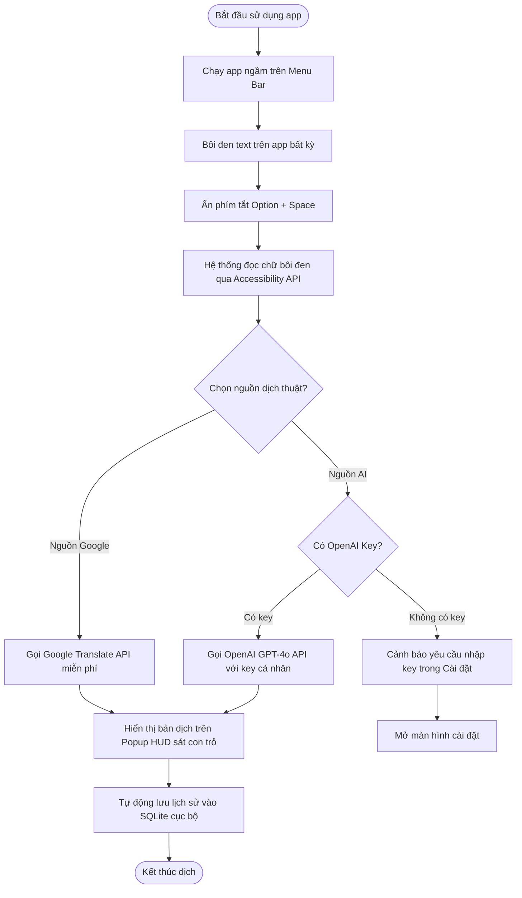

# Phân Tích Nỗi Đau & Phạm Vi (Pain And Scope) — TranslatorAI

## Input Used

- **Context version:** 1.1
- **Confirmed requirements:** CR1, CR2, CR4, CR5 (CR3 deferred to Future Phase)
- **Assumptions:** A1, A2, A3
- **Constraints:** Phát triển native macOS 14+, không lưu dữ liệu trên server, bàn giao trong 1 - 1.5 tháng, không bao gồm OCR trong bản MVP.

---

## Pain Points (Nỗi đau của khách hàng)

| ID | Nỗi đau (Pain Point) | Bằng chứng (Evidence) | Mức độ | Giả thuyết Nguyên nhân (Root Cause) | Độ tin cậy (Confidence) |
| --- | --- | --- | --- | --- | --- |
| PP-1 | Người dùng mất nhiều thời gian chuyển đổi qua lại giữa tab trình duyệt để dịch văn bản khi đang đọc tài liệu hoặc chat (Slack, Zalo, WeChat). | Khảo sát nhu cầu sử dụng thực tế của khách hàng. | High | Không có công cụ dịch thuật tích hợp trực tiếp, tức thời tại màn hình làm việc. | High |
| PP-2 | Lo ngại rò rỉ dữ liệu và tài liệu nội bộ nhạy cảm (thông tin tài chính, mã nguồn, tài liệu mật) khi dịch qua các dịch vụ trực tuyến. | Yêu cầu bảo mật cục bộ của khách hàng. | High | Hầu hết các ứng dụng dịch thuật miễn phí đều thu thập dữ liệu dịch và lưu lịch sử trên cloud server của bên thứ ba. | High |

*(Lưu ý: Nỗi đau liên quan đến dịch văn bản không thể bôi đen/OCR trên hình ảnh được dời sang giải quyết ở giai đoạn tiếp theo).*

---

## Solution Direction (Hướng giải quyết)

### Proposed Solution Overview
Xây dựng ứng dụng native desktop **TranslatorAI** chạy ngầm trên thanh Menu Bar của macOS và hỗ trợ phím tắt toàn hệ thống. 
- Khi người dùng bôi đen văn bản ở bất kỳ đâu và nhấn tổ hợp phím tắt (ví dụ: `Option + Space`), ứng dụng sẽ tự động trích xuất chữ qua Accessibility API và hiển thị bong bóng popover (HUD Overlay) chứa bản dịch ngay cạnh con trỏ chuột.
- Bản dịch hỗ trợ 2 nguồn: Google Translate API (miễn phí, dịch nhanh) và OpenAI GPT-4o API (dành cho các bản dịch chuyên sâu, dịch thuật ngữ kỹ thuật, sử dụng API key cá nhân của người dùng). Lịch sử dịch chỉ được lưu trữ cục bộ trong cơ sở dữ liệu SQLite dưới máy của người dùng.

### Value Mapping (Bản đồ Giá trị Kinh doanh)

| Tính năng / Giải pháp | Nỗi đau được giải quyết | Giá trị Kinh doanh mang lại | Cơ sở Bằng chứng | Ai hưởng lợi |
| :--- | :--- | :--- | :--- | :--- |
| **Phím tắt toàn cục & Popup dịch tại chỗ (HUD)** | PP-1 (Mất thời gian chuyển tab) | Tiết kiệm hơn 90% thời gian thao tác dịch thuật. Loại bỏ hoàn toàn sự đứt gãy luồng suy nghĩ khi làm việc. | Đo lường thời gian: Chuyển tab dịch mất 8-12 giây; nhấn phím tắt dịch tại chỗ mất <1 giây. | Lập trình viên, Biên dịch viên, Nhân viên văn phòng |
| **Lưu trữ SQLite cục bộ, không dùng server trung gian** | PP-2 (Rò rỉ dữ liệu nhạy cảm) | Đảm bảo tính riêng tư tuyệt đối cho tài liệu doanh nghiệp. Đáp ứng các tiêu chuẩn bảo mật khắt khe nhất của tổ chức. | Kiểm thử kỹ thuật: Ứng dụng không thực hiện bất kỳ request gửi dữ liệu nào về server quản lý trung tâm. Lịch sử lưu hoàn toàn dưới máy người dùng. | Doanh nghiệp, Chuyên gia tài chính, Lập trình viên |

---

## Scope Register (Đăng ký Phạm vi)

### In Scope (Trong phạm vi phát triển)

| ID | Tính năng (Item) | Phân nhóm (MoSCoW) | Maps To | Lý do |
| --- | --- | --- | --- | --- |
| **S-1** | Kiến trúc Native Menu Bar App | **Must-have** | CR1 | Ứng dụng chạy ngầm nhẹ, dễ dàng gọi từ khay hệ thống macOS. |
| **S-2** | Hệ thống lắng nghe Phím tắt toàn cục (Option + Space) | **Must-have** | CR2 | Kích hoạt dịch thuật từ bất kỳ cửa sổ ứng dụng nào. |
| **S-3** | Bong bóng Popup HUD cạnh con trỏ chuột | **Must-have** | CR2 | Hiển thị kết quả dịch tức thời và tự động biến mất khi click ra ngoài. |
| **S-5** | Client kết nối API Google & OpenAI | **Must-have** | CR4 | Thực hiện request dịch thuật qua Google Web Wrapper và OpenAI GPT-4o API. |
| **S-6** | Lưu trữ lịch sử cục bộ bằng SQLite | **Must-have** | CR5 | Lưu lịch sử dịch thuật dưới máy người dùng dưới dạng mã hóa cơ bản. |
| **S-7** | Giao diện cài đặt (Preferences View) | **Must-have** | CR4, CR5 | Cấu hình OpenAI API Key cá nhân, chỉnh sửa phím tắt, bật tắt lưu lịch sử. |

### Out Of Scope (Ngoài phạm vi phát triển)

| ID | Tính năng (Item) | Lý do |
| --- | --- | --- |
| **O-1** | Cloud database sync (Đồng bộ đám mây) | Tránh rủi ro rò rỉ dữ liệu lên server và giảm chi phí vận hành hạ tầng máy chủ trung tâm. |
| **O-2** | Tự cấp và chia sẻ API key OpenAI miễn phí | Tránh phát sinh chi phí hóa đơn sử dụng AI khổng lồ cho nhà phát triển ứng dụng. |

### Future Phase (Các giai đoạn tương lai)

| ID | Tính năng (Item) | Lý do |
| --- | --- | --- |
| **FP-1** | Phát triển phiên bản trên Windows OS | Giai đoạn MVP chỉ tập trung tối ưu hóa hiệu năng native trên hệ điều hành macOS. |
| **FP-2** | Dịch thuật âm thanh thời gian thực (Speech-to-Speech) | Đòi hỏi tài nguyên tính toán lớn và làm tăng độ phức tạp của ứng dụng MVP. |
| **FP-3** | Công cụ chụp vùng màn hình & Quét chữ OCR offline | Giảm thời gian phát triển bản MVP; chuyển sang giai đoạn sau. |
| **FP-4** | Trình chỉnh sửa văn bản gốc trực tiếp trên Popup | Tính năng đi kèm hỗ trợ sửa lỗi OCR, không cần thiết cho luồng dịch bôi đen text. |

### Pending Decisions

*(Không có)*

---

## Risks (Rủi ro & Biện pháp giảm thiểu)

| ID | Rủi ro (Risk) | Mức độ | Biện pháp giảm thiểu (Mitigation) |
| --- | --- | --- | --- |
| **R-1** | Hệ điều hành macOS thắt chặt bảo mật, yêu cầu người dùng tự cấp quyền Accessibility (Trợ năng) thủ công. | Medium | Thiết kế màn hình Onboarding hướng dẫn trực quan bằng hình ảnh khi mở ứng dụng lần đầu để PM dễ dàng cấp quyền trong System Settings. |
| **R-2** | Kết nối mạng chập chờn khi dịch bằng API đám mây. | Low | Hiển thị thông báo trạng thái kết nối trực quan trên Popup HUD. Lưu trữ tạm request để dịch lại khi mạng ổn định. |

---

## Luồng người dùng (User Flow)



---

## Phác thảo Giao diện (High-Level Wireframe Text)

Ứng dụng hướng tới thiết kế phẳng, siêu tối giản theo phong cách giao diện native của macOS (Apple Design Guidelines):

### 1. Bong bóng dịch nhanh (Floating Popup HUD)
Xuất hiện ngay sát vị trí con trỏ chuột, dạng cửa sổ popover có bo góc và đổ bóng mờ (Acrylic background):
```
+-------------------------------------------------------------+
| Origin: [ EN v ]  ------------------------  Target: [ VI v ]|
|                                                             |
| [ Văn bản gốc: ]                                            |
| Developer experience is crucial for project velocity.       |
|                                                             |
| [ Bản dịch: ]                                               |
| Trải nghiệm nhà phát triển là cực kỳ quan trọng đối với     |
| tốc độ của dự án.                                           |
+-------------------------------------------------------------+
| Nguồn: (*) Google Translate  ( ) OpenAI AI  [ Copy Bản Dịch]|
+-------------------------------------------------------------+
```

### 2. Màn hình Cài đặt (Preferences Panel)
Giao diện macOS System Preferences tiêu chuẩn chia làm các Tab điều hướng:
```
+-------------------------------------------------------------+
| [ Chung ]     [ API OpenAI ]     [ Phím Tắt ]    [ Lịch Sử ]|
+-------------------------------------------------------------+
| Cấu hình dịch thuật OpenAI:                                  |
| API Key:   [ sk-...........................................]|
| Model:     [ gpt-4o-mini  v ]                               |
| System Prompt dịch thuật:                                   |
| [ Dịch tự nhiên, bảo lưu thuật ngữ chuyên ngành công nghệ ] |
|                                                             |
|                                           [ Lưu Cấu Hình ]  |
+-------------------------------------------------------------+
| Lịch sử cục bộ:                                             |
| [x] Lưu lịch sử dịch tự động dưới máy (SQLite)              |
| Lịch sử hiện tại: 124 bản ghi.          [ Xóa Lịch Sử ]     |
+-------------------------------------------------------------+
```
