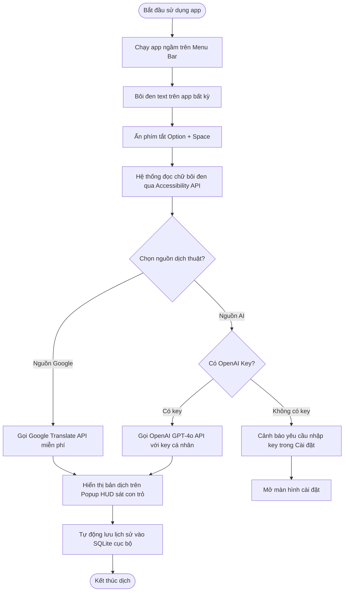

# 02 - Giải Pháp Đề Xuất & Quy Trình Trải Nghiệm

## 2.1 Tổng Quan Giải Pháp (Solution Overview)

TranslatorAI là ứng dụng native chạy ngầm trên thanh Menu Bar của macOS, được thiết kế tối giản nhằm cung cấp trải nghiệm dịch thuật tức thời tại chỗ cho người dùng. Ứng dụng tích hợp phím tắt toàn hệ thống để lấy văn bản bôi đen và kết nối linh hoạt với cả Google Translate lẫn trí tuệ nhân tạo OpenAI GPT-4o. Bằng cách lưu trữ dữ liệu hoàn toàn trong cơ sở dữ liệu SQLite cục bộ, TranslatorAI đảm bảo tính bảo mật và quyền riêng tư tuyệt đối cho mọi tài liệu của người dùng.

## 2.2 Các Tính Năng Chính (Key Features)

**Kiến trúc Menu Bar gọn nhẹ**
Ứng dụng chạy ngầm trên thanh trạng thái Menu Bar của macOS giúp tối ưu hóa tài nguyên hệ thống, giữ RAM tĩnh ở mức cực thấp và sẵn sàng kích hoạt bất cứ lúc nào.

**Lắng nghe phím tắt toàn cục**
Tự động bắt sự kiện phím tắt toàn hệ thống để kích hoạt nhanh bong bóng dịch mà không cần chuyển đổi ứng dụng đang làm việc.

**Bong bóng dịch thuật HUD thông minh**
Hiển thị kết quả dịch ngay sát vị trí con trỏ chuột dưới dạng popover mờ (Acrylic overlay), tự động biến mất khi người dùng click ra ngoài để tránh gây gián đoạn luồng làm việc.

**Tích hợp đa nguồn dịch thuật**
Hỗ trợ dịch nhanh miễn phí qua Google Translate hoặc dịch nâng cao bằng OpenAI GPT-4o sử dụng API Key cá nhân của người dùng nhằm dịch thuật ngữ chuyên ngành chuẩn xác nhất.

**Quản lý lịch sử SQLite cục bộ**
Tự động lưu lại tất cả lịch sử dịch thuật dưới dạng cơ sở dữ liệu SQLite mã hóa dưới máy, cho phép tra cứu nhanh hoặc xóa hoàn toàn lịch sử ngay trên ứng dụng.

**Giao diện cài đặt trực quan (Preferences)**
Hỗ trợ người dùng dễ dàng cấu hình API Key OpenAI, tùy chỉnh tổ hợp phím tắt kích hoạt nhanh, chọn model AI và bật/tắt chức năng tự động lưu lịch sử dịch thuật.

## 2.3 Luồng Người Dùng (User Flow)

Quy trình sử dụng TranslatorAI được thiết kế tối giản nhằm mang lại trải nghiệm dịch thuật tức thời thông qua thao tác phím tắt nhanh và xử lý cục bộ an toàn.

