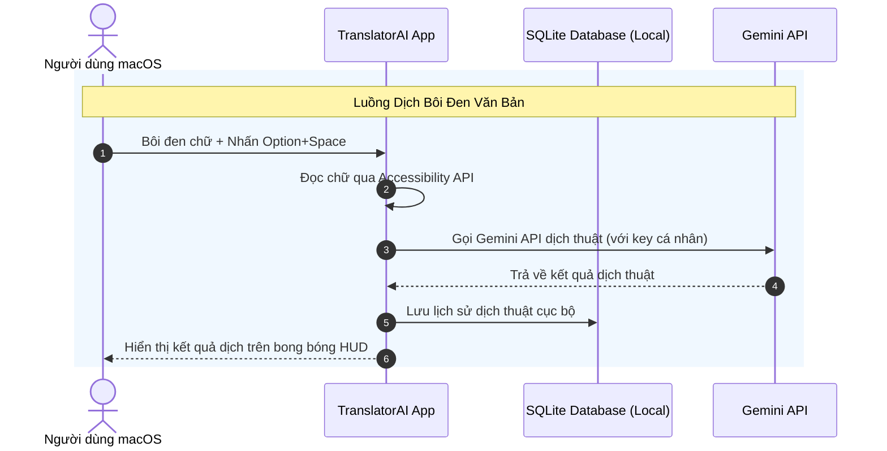

# 05 - Kiến Trúc Kỹ Thuật Sơ Bộ

## 5.1 Kiến Trúc Mục Tiêu (Target Architecture)

TranslatorAI được thiết kế theo kiến trúc local-first (ưu tiên xử lý cục bộ) tối giản. Ứng dụng chạy native trên macOS đóng vai trò điều phối tất cả các tương tác người dùng, lắng nghe phím tắt và thực hiện gọi dịch thuật qua Gemini API. Kết nối mạng chỉ được thiết lập trực tiếp từ máy người dùng đến máy chủ API của Google (Gemini) để thực hiện dịch thuật mà không đi qua bất kỳ máy chủ trung gian nào. Kiến trúc được thiết kế theo mô hình multi-provider (protocol/interface pattern) để dễ dàng bổ sung thêm nguồn dịch ở các giai đoạn sau.

```mermaid
graph TD
    subgraph macOS Device (Xử lý Cục bộ)
        MenuApp[Menu Bar status item] --- Controller[Main Application Controller]
        Hotkey[Global Hotkey listener] -->|Trigger event| Controller
        Controller -->|Lấy chữ bôi đen| AccessAPI[Accessibility API]
        AccessAPI -->|Văn bản gốc| HUD[Floating Popup HUD Overlay]
        Controller --- HUD
        HUD --- DB[(SQLite Database)]
        Controller --- Provider[Translation Provider Protocol]
    end
    
    subgraph Cloud Services (Đám mây)
        Provider -->|Request dịch AI với Key cá nhân| GeminiAPI[Gemini API]
    end
```

## 5.2 Công Nghệ Lựa Chọn (Tech Stack)

Để tối ưu hóa hiệu năng native và bảo mật trên hệ điều hành macOS, đội ngũ phát triển đề xuất các công nghệ sau:
- **Frontend / Client Framework:** Swift & SwiftUI (macOS 14+ Sonoma) giúp xây dựng giao diện native mượt mà, phản hồi tức thời, sử dụng tài nguyên hệ thống (CPU, RAM) cực kỳ tối ưu và tận dụng tốt các API SwiftUI hiện đại.
- **Cơ sở dữ liệu (Database):** SQLite (Local file) là hệ quản trị cơ sở dữ liệu quan hệ cục bộ nhỏ gọn, được tích hợp sẵn trên macOS, lưu trữ lịch sử dịch thuật trực tiếp trên ổ đĩa máy tính người dùng mà không cần cài đặt dịch vụ DB chạy ngầm.
- **Cổng phím tắt & Sự kiện:** AppKit (NSGlobalEventMonitor) và Accessibility APIs giúp lắng nghe phím tắt toàn cục và trích xuất chữ được bôi đen từ các ứng dụng đang hoạt động một cách chính xác.
- **Trí tuệ nhân tạo (AI Engine) & Nguồn dịch:** Gemini API (thông qua Google AI SDK for Swift hoặc REST client) hỗ trợ dịch thuật AI chất lượng cao với chi phí hợp lý. Kiến trúc multi-provider (protocol pattern) cho phép bổ sung thêm nguồn dịch (OpenAI, Google Translate, v.v.) ở các giai đoạn sau mà không cần thay đổi logic UI.

## 5.3 Luồng Dữ Liệu Xử Lý (Data Flow)

Luồng xử lý dữ liệu dịch thuật của ứng dụng tập trung vào nhánh Dịch bôi đen văn bản trực tiếp.



## 5.4 Quy Mô & Dung Lượng (Capacity & Sizing)

Hệ thống được tối ưu hóa cho môi trường chạy đơn lập cục bộ trên từng máy cá nhân:
- **Người dùng hoạt động:** Ứng dụng chạy client-side đơn lẻ trên máy cá nhân, do đó không giới hạn số lượng người dùng đồng thời trên toàn hệ thống vì không sử dụng máy chủ chia sẻ tài nguyên.
- **Tải trọng CPU/RAM:** Mức tiêu hao RAM tĩnh khi chạy ngầm dưới 30MB; khi thực hiện dịch thuật peak CPU dưới 5% (trên chip Apple Silicon M1 trở lên) đảm bảo không gây nóng máy hay sụt pin.
- **Chiến lược lưu trữ:** Dữ liệu lịch sử dịch dạng text được SQLite nén tối ưu, ước tính 1,000 bản ghi lịch sử chỉ chiếm khoảng dưới 2MB dung lượng bộ nhớ.

## 5.5 Bảo Mật & Riêng Tư (Security & Privacy)

TranslatorAI đặt quyền riêng tư của dữ liệu người dùng làm mục tiêu thiết kế cốt lõi:
- **Bảo mật dữ liệu dịch:** 100% dữ liệu văn bản gốc và bản dịch được xử lý tại local hoặc truyền trực tiếp từ máy người dùng đến máy chủ Gemini API của Google, hoàn toàn không qua máy chủ trung gian của nhà phát triển.
- **Bảo mật khóa API:** Gemini API Key cá nhân của người dùng được lưu trữ an toàn trong macOS Keychain sử dụng Apple Security framework, đảm bảo các ứng dụng khác trên máy không thể truy cập trái phép.
- **Giao thức truyền tải:** Tất cả các truy vấn dịch thuật gửi tới Gemini API đều bắt buộc sử dụng HTTPS mã hóa SSL/TLS 1.3 để ngăn chặn tấn công nghe lén (Man-in-the-middle).
